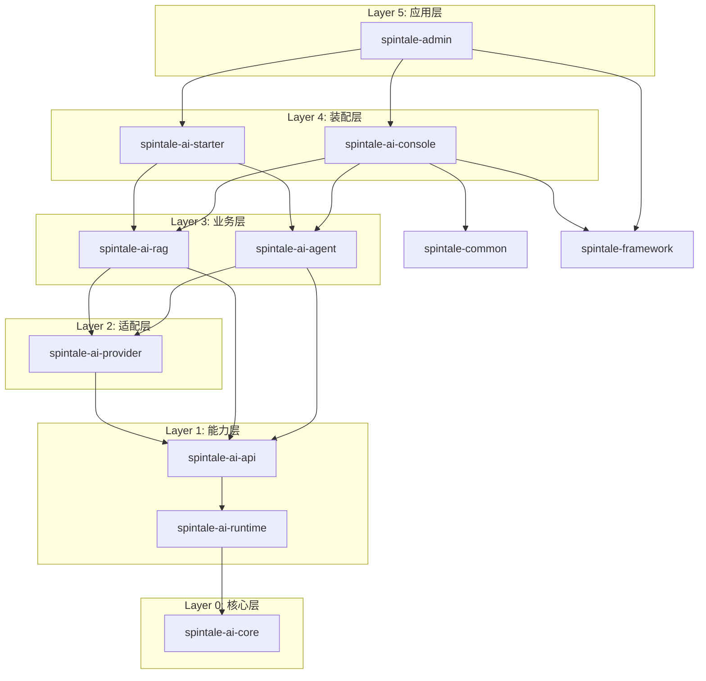

# SpinTale AI 模块重构与升级方案

## 1. 项目现状分析

### 1.1 当前模块结构

```text
SpinTale
├── spintale-admin          (应用启动入口)
├── spintale-common         (RuoYi公共模块)
├── spintale-framework      (RuoYi框架核心)
├── spintale-system         (系统管理模块)
├── spintale-ai-core        (AI核心抽象与基础设施)
├── spintale-ai-api         (AI客户端API与Advisor)
├── spintale-ai-agent       (Agent、Tool、Workflow)
├── spintale-ai-retrieval   (RAG检索与向量存储)
├── spintale-ai-providers   (模型Provider适配)
└── spintale-ai-starter     (Spring Boot自动配置)
```

### 1.2 当前依赖关系

```text
【RuoYi基础模块】
spintale-admin -> spintale-framework, spintale-ai-starter

【AI模块依赖链】
spintale-ai-core -> Spring Boot, Resilience4j, Caffeine, OpenTelemetry
spintale-ai-api -> spintale-ai-core, LangChain4j, Redis, Caffeine
spintale-ai-providers -> spintale-ai-core, spintale-ai-api, LangChain4j
spintale-ai-retrieval -> spintale-ai-core, spintale-ai-api, Milvus, PDFBox
spintale-ai-agent -> spintale-ai-core, spintale-ai-api, spintale-ai-retrieval, Temporal
spintale-ai-starter -> spintale-ai-core, spintale-ai-api, spintale-ai-agent, spintale-ai-retrieval, spintale-ai-providers
```

### 1.3 现状问题分析

| 问题 | 现状 | 影响 |
|------|------|------|
| **Core依赖过重** | spintale-ai-core依赖Spring Boot、Resilience4j等 | 违背"核心层零依赖"原则，无法独立复用 |
| **API模块定位模糊** | spintale-ai-api混合了Client、Advisor、Skill | 职责不清晰，边界模糊 |
| **缺少Runtime概念** | 运行时逻辑分散在core和api中 | 缺乏统一的执行上下文和追踪 |
| **缺少Console层** | 无AI管理控制台模块 | 无法与RuoYi权限、菜单、日志集成 |
| **命名不一致** | retrieval而非rag，providers而非provider | 语义不够准确 |
| **Agent依赖Retrieval** | spintale-ai-agent依赖spintale-ai-retrieval | Agent与RAG耦合，不够灵活 |

### 1.4 技术栈现状

项目已集成的核心技术：

```text
【AI框架】
- LangChain4j 1.13.1 (统一AI服务抽象)
- LangChain4j OpenAI
- LangChain4j Ollama

【基础设施】
- Resilience4j (熔断、限流、重试)
- Caffeine (本地缓存)
- Redisson (Redis客户端)
- OpenTelemetry (分布式追踪)

【向量数据库】
- Milvus 2.5.8

【工作流引擎】
- Temporal 1.35.0

【文档处理】
- PDFBox 3.0.7
- Apache POI
```

## 2. 重构目标与原则

### 2.1 核心目标

```text
SpinTale = RuoYi框架 + 自定义AI框架

核心定位：
1. 以RuoYi为基础框架（权限、菜单、日志、用户管理等）
2. 集成自研AI能力（Chat、RAG、Agent、Tool等）
3. 通过console模块实现无缝集成
4. 保持AI能力可独立使用（starter模块）
```

**架构组成**：

```text
┌─────────────────────────────────────────────────────────┐
│                    SpinTale 项目                         │
├─────────────────────────────────────────────────────────┤
│                                                          │
│  【RuoYi框架层】                                          │
│  ├── spintale-admin      (启动入口)                      │
│  ├── spintale-common     (公共组件)                      │
│  ├── spintale-framework  (框架核心)                      │
│  └── spintale-system     (系统管理)                      │
│                                                          │
│  【AI能力层】                                             │
│  ├── spintale-ai-core      (核心抽象)                    │
│  ├── spintale-ai-runtime   (运行时)                      │
│  ├── spintale-ai-api       (客户端API)                   │
│  ├── spintale-ai-provider  (模型适配)                    │
│  ├── spintale-ai-rag       (RAG能力)                     │
│  └── spintale-ai-agent     (Agent能力)                   │
│                                                          │
│  【集成层】                                               │
│  ├── spintale-ai-starter   (自动配置，可独立使用)        │
│  └── spintale-ai-console   (RuoYi集成，强绑定)           │
│                                                          │
└─────────────────────────────────────────────────────────┘
```

**为什么采用RuoYi + 自定义AI框架的组合？**

1. **RuoYi优势**：
   - ✅ 成熟的后台管理框架
   - ✅ 完善的权限体系（RBAC）
   - ✅ 丰富的组件（字典、配置、定时任务等）
   - ✅ 开箱即用的管理界面

2. **自定义AI框架优势**：
   - ✅ 完全可控，可深度定制
   - ✅ 统一的模型抽象（支持多Provider）
   - ✅ 完整的RAG Pipeline
   - ✅ 可观测的Agent系统
   - ✅ 可独立使用（不绑定RuoYi）

3. **组合后的优势**：
   - ✅ 快速搭建AI管理后台（RuoYi提供基础）
   - ✅ 强大的AI能力（自定义框架提供）
   - ✅ 企业级特性（权限、审计、日志）
   - ✅ 灵活部署（可拆分独立使用）

**RuoYi + AI框架实际使用示例**：

**示例1：AI对话接口（集成RuoYi权限）**

```java
@RestController
@RequestMapping("/ai/chat")
public class AiChatController extends BaseController {
    
    @Autowired
    private ChatClient chatClient;
    
    /**
     * AI对话接口
     * 
     * @RuoYi集成点：
     * - @PreAuthorize: 权限控制
     * - @Log: 操作日志记录
     * - AjaxResult: 统一返回格式
     * - getUserId(): 获取当前用户（RuoYi提供）
     */
    @PreAuthorize("@ss.hasPermi('ai:chat:use')")
    @Log(title = "AI对话", businessType = BusinessType.OTHER)
    @PostMapping("/send")
    public AjaxResult chat(@RequestBody ChatRequest request) {
        // 1. RuoYi权限已校验
        Long userId = getUserId();  // RuoYi提供
        
        // 2. 使用AI能力（自定义框架）
        String response = chatClient
            .prompt(request.getMessage())
            .user(userId.toString())
            .call()
            .content();
        
        // 3. RuoYi返回格式
        return AjaxResult.success(response);
    }
}
```

**示例2：知识库管理（RuoYi菜单+AI能力）**

```java
@RestController
@RequestMapping("/ai/knowledge")
public class KnowledgeController extends BaseController {
    
    @Autowired
    private KnowledgeBaseService knowledgeService;  // AI能力
    
    /**
     * 创建知识库
     */
    @PreAuthorize("@ss.hasPermi('ai:knowledge:add')")
    @Log(title = "知识库管理", businessType = BusinessType.INSERT)
    @PostMapping
    public AjaxResult add(@RequestBody KnowledgeBase kb) {
        // RuoYi: 数据权限校验
        kb.setCreateBy(getUsername());
        kb.setCreateTime(DateUtils.getNowDate());
        
        // AI框架: 创建知识库
        knowledgeService.createKnowledgeBase(kb);
        
        return AjaxResult.success();
    }
    
    /**
     * 文档上传入库（RAG Pipeline）
     */
    @PreAuthorize("@ss.hasPermi('ai:knowledge:upload')")
    @PostMapping("/upload")
    public AjaxResult upload(@RequestParam("file") MultipartFile file, 
                             @RequestParam Long kbId) {
        // AI框架: RAG文档处理
        DocumentProcessResult result = knowledgeService
            .ingestDocument(kbId, file)
            .parse()      // 解析
            .chunk()      // 分块
            .embed()      // 向量化
            .index();     // 入库
        
        return AjaxResult.success(result);
    }
}
```

**示例3：Agent工作流（RuoYi定时任务+AI Agent）**

```java
/**
 * Agent定时任务
 * 
 * @RuoYi集成点：
 * - @Component: Spring管理
 * - Quartz定时任务: RuoYi定时任务系统
 */
@Component("aiAgentTask")
public class AiAgentTask {
    
    @Autowired
    private AgentRuntime agentRuntime;
    
    /**
     * 定时执行Agent任务
     * RuoYi配置：cron表达式、任务状态管理等
     */
    public void executeAgentTask(Long agentId, String input) {
        // AI框架: Agent执行
        AgentRunResult result = agentRuntime
            .createRun(agentId, input)
            .execute();
        
        // 结果处理
        log.info("Agent任务执行完成: {}", result.getOutput());
    }
}
```

**RuoYi菜单配置示例**：

```sql
-- AI控制台菜单（RuoYi菜单系统）
INSERT INTO sys_menu VALUES(
    2000, 'AI控制台', 0, 5, 'ai', NULL, NULL, 1, 0, 'M', '0', '0', '', 'robot', 'admin', sysdate(), '', NULL, 'AI管理菜单'
);

-- 模型管理
INSERT INTO sys_menu VALUES(
    2001, '模型管理', 2000, 1, 'model', 'ai/model/index', NULL, 1, 0, 'C', '0', '0', 'ai:model:list', 'model', 'admin', sysdate(), '', NULL, '模型配置管理'
);

-- 知识库管理
INSERT INTO sys_menu VALUES(
    2002, '知识库管理', 2000, 2, 'knowledge', 'ai/knowledge/index', NULL, 1, 0, 'C', '0', '0', 'ai:knowledge:list', 'book', 'admin', sysdate(), '', NULL, '知识库管理菜单'
);

-- Agent管理
INSERT INTO sys_menu VALUES(
    2003, 'Agent管理', 2000, 3, 'agent', 'ai/agent/index', NULL, 1, 0, 'C', '0', '0', 'ai:agent:list', 'cascader', 'admin', sysdate(), '', NULL, 'Agent管理菜单'
);
```

**配置文件示例**：

```yaml
# application.yml
spring:
  datasource:
    # RuoYi数据源配置
    url: jdbc:mysql://localhost:3306/spintale?useUnicode=true
    username: root
    password: password

# RuoYi配置
ruoyi:
  name: SpinTale
  version: 3.9.2
  captchaEnabled: true

# AI框架配置（自定义AI框架）
spintale:
  ai:
    default-provider: openai
    providers:
      openai:
        api-key: ${OPENAI_API_KEY}
        base-url: https://api.openai.com/v1
        default-model: gpt-4-turbo-preview
      ollama:
        base-url: http://localhost:11434
        default-model: llama2
    rag:
      chunk-size: 500
      chunk-overlap: 50
      top-k: 5
    agent:
      max-steps: 10
      timeout: 300000
```

**项目启动后的能力**：

```text
启动后即可获得：

【RuoYi提供的能力】
✅ 用户管理、角色管理、菜单管理
✅ 部门管理、岗位管理、字典管理
✅ 登录认证、权限控制、操作日志
✅ 在线用户、定时任务、服务监控
✅ 代码生成、系统通知

【AI框架提供的能力】
✅ 模型配置管理（多Provider支持）
✅ 知识库管理（文档上传、RAG检索）
✅ Agent管理（Tool配置、工作流）
✅ 运行历史查看（Trace、Token、Cost）
✅ AI对话接口（流式、同步）
✅ Embedding接口
✅ RAG检索增强生成

【集成后的新能力】
✅ AI功能权限控制（继承RuoYi权限体系）
✅ AI操作日志记录（继承RuoYi日志系统）
✅ AI任务定时执行（集成RuoYi定时任务）
✅ AI使用统计分析（数据权限隔离）
✅ AI成本控制与审计（企业级特性）
```

### 2.2 设计原则

基于对Spring AI、LangChain4j、Semantic Kernel、LlamaIndex等框架的调研：

```text
【原则1：分层抽象】
- Core层：纯接口定义，零框架依赖
- Runtime层：执行上下文、追踪、策略
- API层：客户端、Advisor、拦截器
- Provider层：模型适配，每个Provider独立模块
- 业务层：RAG、Agent基于核心抽象构建
- Console层：管理控制台，RuoYi集成

【原则2：依赖单向】
- 上层可依赖下层，下层不依赖上层
- RAG与Agent互不依赖
- Provider不依赖Runtime

【原则3：职责清晰】
- 每个模块职责单一、边界清晰
- 避免跨层调用和循环依赖

【原则4：可观测优先】
- 每次调用生成traceId/runId
- 记录token、cost、latency
- 支持分布式追踪

【原则5：渐进式重构】
- 保持现有功能可用
- 分阶段调整结构
- 向后兼容
```

---

## 3. 推荐模块结构

### 3.1 目标结构

基于现状分析和框架对比，推荐以下模块结构：

```text
SpinTale
├── spintale-admin          (应用启动入口)
├── spintale-common         (RuoYi公共模块)
├── spintale-framework      (RuoYi框架核心)
├── spintale-system         (系统管理模块)
│
├── spintale-ai-core        (核心抽象层 - 纯接口)
├── spintale-ai-runtime     (运行时层 - 执行上下文)
├── spintale-ai-api         (API层 - 客户端与Advisor)
├── spintale-ai-provider    (Provider层 - 模型适配)
├── spintale-ai-rag         (业务层 - RAG能力)
├── spintale-ai-agent       (业务层 - Agent能力)
├── spintale-ai-starter     (装配层 - 自动配置)
└── spintale-ai-console     (控制台层 - 管理接口)
```

### 3.2 模块职责定义

| 模块 | 定位 | 核心职责 |
|------|------|----------|
| **spintale-ai-core** | 核心抽象层 | 定义ChatModel、EmbeddingModel、VectorStore、Tool等核心接口，纯POJO，零依赖 |
| **spintale-ai-runtime** | 运行时层 | 统一执行上下文、traceId/runId生成、策略管理、成本统计、分布式追踪 |
| **spintale-ai-api** | API层 | ChatClient/EmbeddingClient流畅API、Advisor责任链、拦截器 |
| **spintale-ai-provider** | Provider层 | OpenAI、Ollama、Azure等模型适配，模型路由、能力发现 |
| **spintale-ai-rag** | 业务层 | 文档解析、向量化、检索、重排、RAG Pipeline |
| **spintale-ai-agent** | 业务层 | Agent定义、Tool执行、Memory管理、Workflow编排 |
| **spintale-ai-starter** | 装配层 | Spring Boot自动配置、配置属性、默认Bean装配。**独立模块，可脱离RuoYi使用** |
| **spintale-ai-console** | 控制台层 | Controller、权限适配、操作日志、AI管理功能。**强绑定RuoYi，不可脱离使用** |

**模块设计说明**：

**为什么要保持starter和console分离？**

1. **职责不同**：
   - starter：配置层（怎么做），负责自动配置、Bean装配
   - console：控制层（做什么），负责HTTP接口、权限管理

2. **复用场景**：
   ```text
   场景1：完整RuoYi项目 -> 使用 starter + console
   场景2：只用AI能力（非RuoYi项目）-> 只用 starter
   场景3：自定义管理界面 -> 使用 starter + 自己实现console
   ```

3. **依赖隔离**：
   - starter不依赖RuoYi，保持纯净
   - console强依赖RuoYi（spintale-common/framework/system）

4. **符合Spring Boot惯例**：
   所有Spring Boot starter都是独立模块（如mybatis-spring-boot-starter）

**AI能力独立使用方式**：

**方式1：在其他Spring Boot项目中使用**（完全脱离RuoYi）

```xml
<!-- 只需依赖starter -->
<dependencies>
    <dependency>
        <groupId>com.spintale</groupId>
        <artifactId>spintale-ai-starter</artifactId>
        <version>3.9.2</version>
    </dependency>
    <!-- 不需要引入任何RuoYi依赖 -->
</dependencies>
```

```yaml
# application.yml配置
spintale:
  ai:
    provider: openai
    openai:
      api-key: ${OPENAI_API_KEY}
      model: gpt-4-turbo-preview
```

```java
// 直接使用AI能力
@Service
public class MyService {
    @Autowired
    private ChatClient chatClient;  // 由starter自动装配
    
    public String chat(String question) {
        return chatClient.prompt(question).call().content();
    }
}
```

**方式2：在微服务架构中使用**

```text
微服务架构示例：
├── user-service (用户服务，RuoYi)
├── order-service (订单服务，RuoYi)
├── ai-service (AI服务，非RuoYi)  ← 只用starter
│   ├── 依赖：spintale-ai-starter
│   └── 不依赖：RuoYi相关模块
└── notification-service (通知服务)
```

**方式3：作为SDK提供给其他团队**

```text
其他团队使用步骤：
1. 引入依赖：spintale-ai-starter
2. 配置API Key
3. 直接调用ChatClient/EmbeddingClient
4. 无需关心RuoYi、权限、数据库等
```

**方式4：独立启动的AI微服务**

```java
@SpringBootApplication
public class AiServiceApplication {
    public static void main(String[] args) {
        SpringApplication.run(AiServiceApplication.class, args);
    }
}

@RestController
@RequestMapping("/ai")
class AiController {
    @Autowired
    private ChatClient chatClient;
    
    @PostMapping("/chat")
    public String chat(@RequestBody String question) {
        return chatClient.prompt(question).call().content();
    }
    
    @PostMapping("/rag")
    public String rag(@RequestBody String question) {
        // RAG检索增强生成
        return ragClient.query(question).answer();
    }
}
```

**独立使用的能力清单**：

| 能力 | 是否支持 | 说明 |
|------|----------|------|
| Chat对话 | ✅ | ChatClient流畅API |
| 流式输出 | ✅ | Flux响应式流 |
| Embedding向量化 | ✅ | EmbeddingClient |
| RAG检索增强 | ✅ | 完整RAG Pipeline |
| Agent智能体 | ✅ | Tool、Memory、Workflow |
| 多Provider切换 | ✅ | OpenAI、Ollama、Azure等 |
| 分布式追踪 | ✅ | OpenTelemetry |
| 熔断限流 | ✅ | Resilience4j |
| 权限管理 | ❌ | 需要console+RuoYi |
| 操作日志 | ❌ | 需要console+RuoYi |
| 管理界面 | ❌ | 需要console+RuoYi |

**如果合并会导致**：
- ❌ 失去脱离RuoYi使用的能力
- ❌ 其他项目必须引入RuoYi依赖
- ❌ 违背单一职责原则
- ❌ 不符合Spring Boot最佳实践
- ❌ 配置逻辑与业务逻辑耦合

### 3.3 与现有结构对比

| 现有模块 | 现状问题 | 目标模块 | 改进点 |
|----------|----------|----------|--------|
| spintale-ai-core | 依赖过重 | spintale-ai-core | 移除Spring Boot等依赖，保留纯接口 |
| - | 缺失 | spintale-ai-runtime | 新增，统一运行时逻辑 |
| spintale-ai-api | 定位模糊 | spintale-ai-api | 明确为Client和Advisor层 |
| spintale-ai-providers | 命名不准确 | spintale-ai-provider | 改为单数形式，更规范 |
| spintale-ai-retrieval | 命名不准确 | spintale-ai-rag | 改为rag，语义更清晰 |
| spintale-ai-agent | 依赖retrieval | spintale-ai-agent | 移除对rag的依赖 |
| - | 缺失 | spintale-ai-console | 新增，RuoYi集成层 |

### 3.4 依赖关系设计

**设计原则**：
1. **直接依赖**：只声明直接需要的模块（直接调用其类/接口）
2. **依赖传递**：通过Maven依赖传递机制自动获得间接依赖
3. **避免跨层**：每层只依赖直接下层，不跨层依赖

**直接依赖关系**（pom.xml中实际声明）：

```text
【核心抽象层】
spintale-ai-core -> 无依赖（纯接口，零依赖）

【运行时层】
spintale-ai-runtime -> spintale-ai-core

【API层】
spintale-ai-api -> spintale-ai-runtime
（通过传递获得：spintale-ai-core）

【Provider层】
spintale-ai-provider -> spintale-ai-api
（通过传递获得：spintale-ai-runtime, spintale-ai-core）

【业务层】
spintale-ai-rag -> spintale-ai-api, spintale-ai-provider
（通过传递获得：spintale-ai-runtime, spintale-ai-core）
spintale-ai-agent -> spintale-ai-api, spintale-ai-provider
（通过传递获得：spintale-ai-runtime, spintale-ai-core）

【装配层】
spintale-ai-starter -> spintale-ai-rag, spintale-ai-agent
（通过传递获得：spintale-ai-api, spintale-ai-provider, spintale-ai-runtime, spintale-ai-core）

【控制台层】
spintale-ai-console -> spintale-ai-rag, spintale-ai-agent, spintale-common, spintale-framework
（通过传递获得：spintale-ai-api, spintale-ai-provider, spintale-ai-runtime, spintale-ai-core）

【应用层】
spintale-admin -> spintale-framework, spintale-ai-starter, spintale-ai-console
（通过传递获得：所有AI模块）
```

**依赖传递示意图**：

```text
spintale-ai-core (基础)
    ↑
spintale-ai-runtime (依赖core)
    ↑
spintale-ai-api (依赖runtime → 自动获得core)
    ↑
spintale-ai-provider (依赖api → 自动获得runtime+core)
    ↑
spintale-ai-rag / spintale-ai-agent (依赖api+provider → 自动获得所有下层)
    ↑
spintale-ai-starter / spintale-ai-console (依赖业务层 → 自动获得所有AI能力)
    ↑
spintale-admin (依赖starter+console → 自动获得所有模块)
```

### 3.5 分层架构图

**架构分层**（从下到上，依赖方向向上）：

```text
┌─────────────────────────────────────────────────────────┐
│  Layer 5: 应用层                                         │
│  spintale-admin (启动入口)                               │
└─────────────────────────────────────────────────────────┘
                          ↓ 依赖
┌─────────────────────────────────────────────────────────┐
│  Layer 4: 装配层                                         │
│  spintale-ai-starter (自动配置)                          │
│  spintale-ai-console (管理控制台)                        │
└─────────────────────────────────────────────────────────┘
                          ↓ 依赖
┌─────────────────────────────────────────────────────────┐
│  Layer 3: 业务层                                         │
│  spintale-ai-rag (RAG能力)                               │
│  spintale-ai-agent (Agent能力)                           │
└─────────────────────────────────────────────────────────┘
                          ↓ 依赖
┌─────────────────────────────────────────────────────────┐
│  Layer 2: 适配层                                         │
│  spintale-ai-provider (模型适配)                         │
└─────────────────────────────────────────────────────────┘
                          ↓ 依赖
┌─────────────────────────────────────────────────────────┐
│  Layer 1: 能力层                                         │
│  spintale-ai-api (客户端API)                             │
│  spintale-ai-runtime (运行时)                            │
└─────────────────────────────────────────────────────────┘
                          ↓ 依赖
┌─────────────────────────────────────────────────────────┐
│  Layer 0: 核心层                                         │
│  spintale-ai-core (核心抽象)                             │
└─────────────────────────────────────────────────────────┘
```

**Mermaid依赖图**（只显示直接依赖）：



### 3.6 禁止的依赖关系

**依赖规则**：
- 上层可依赖下层，下层不可依赖上层（单向依赖）
- 同层模块互不依赖（RAG与Agent互不依赖）
- 避免循环依赖

```text
【核心层禁止】
spintale-ai-core ❌ 任何框架依赖（Spring Boot、LangChain4j等）
spintale-ai-core ❌ 任何AI模块依赖

【运行时层禁止】
spintale-ai-runtime ❌ spintale-ai-api / spintale-ai-provider
spintale-ai-runtime ❌ spintale-ai-rag / spintale-ai-agent
spintale-ai-runtime ❌ spintale-ai-starter / spintale-ai-console

【API层禁止】
spintale-ai-api ❌ spintale-ai-provider
spintale-ai-api ❌ spintale-ai-rag / spintale-ai-agent
spintale-ai-api ❌ spintale-ai-starter / spintale-ai-console

【Provider层禁止】
spintale-ai-provider ❌ spintale-ai-rag / spintale-ai-agent
spintale-ai-provider ❌ spintale-ai-starter / spintale-ai-console

【业务层禁止】
spintale-ai-rag ❌ spintale-ai-agent (RAG与Agent互不依赖)
spintale-ai-rag ❌ spintale-ai-starter / spintale-ai-console
spintale-ai-agent ❌ spintale-ai-rag (Agent与RAG互不依赖)
spintale-ai-agent ❌ spintale-ai-starter / spintale-ai-console

【装配层禁止】
spintale-ai-starter ❌ spintale-ai-console (装配层互不依赖)
spintale-ai-starter ❌ spintale-common / spintale-framework (不依赖RuoYi)
spintale-ai-console ❌ spintale-ai-starter (装配层互不依赖)
spintale-ai-console ❌ spintale-ai-api / spintale-ai-provider (通过业务层间接获得)

【应用层禁止】
spintale-admin ❌ 直接依赖 spintale-ai-api / spintale-ai-provider / spintale-ai-rag / spintale-ai-agent
spintale-admin ❌ 直接依赖 spintale-ai-runtime / spintale-ai-core
```

### 3.7 Maven依赖配置示例

**spintale-ai-core (零依赖)**：
```xml
<dependencies>
    <!-- 无任何依赖，纯接口定义 -->
</dependencies>
```

**spintale-ai-runtime**：
```xml
<dependencies>
    <dependency>
        <groupId>com.spintale</groupId>
        <artifactId>spintale-ai-core</artifactId>
    </dependency>
</dependencies>
```

**spintale-ai-api**：
```xml
<dependencies>
    <dependency>
        <groupId>com.spintale</groupId>
        <artifactId>spintale-ai-runtime</artifactId>
    </dependency>
    <!-- 通过传递自动获得：spintale-ai-core -->
</dependencies>
```

**spintale-ai-provider**：
```xml
<dependencies>
    <dependency>
        <groupId>com.spintale</groupId>
        <artifactId>spintale-ai-api</artifactId>
    </dependency>
    <!-- 通过传递自动获得：spintale-ai-runtime, spintale-ai-core -->
</dependencies>
```

**spintale-ai-rag**：
```xml
<dependencies>
    <dependency>
        <groupId>com.spintale</groupId>
        <artifactId>spintale-ai-api</artifactId>
    </dependency>
    <dependency>
        <groupId>com.spintale</groupId>
        <artifactId>spintale-ai-provider</artifactId>
    </dependency>
    <!-- 通过传递自动获得：spintale-ai-runtime, spintale-ai-core -->
</dependencies>
```

**spintale-ai-agent**：
```xml
<dependencies>
    <dependency>
        <groupId>com.spintale</groupId>
        <artifactId>spintale-ai-api</artifactId>
    </dependency>
    <dependency>
        <groupId>com.spintale</groupId>
        <artifactId>spintale-ai-provider</artifactId>
    </dependency>
    <!-- 通过传递自动获得：spintale-ai-runtime, spintale-ai-core -->
</dependencies>
```

**spintale-ai-starter**：
```xml
<dependencies>
    <dependency>
        <groupId>com.spintale</groupId>
        <artifactId>spintale-ai-rag</artifactId>
    </dependency>
    <dependency>
        <groupId>com.spintale</groupId>
        <artifactId>spintale-ai-agent</artifactId>
    </dependency>
    <!-- 通过传递自动获得：api, provider, runtime, core -->
</dependencies>
```

**spintale-ai-console**：
```xml
<dependencies>
    <dependency>
        <groupId>com.spintale</groupId>
        <artifactId>spintale-ai-rag</artifactId>
    </dependency>
    <dependency>
        <groupId>com.spintale</groupId>
        <artifactId>spintale-ai-agent</artifactId>
    </dependency>
    <dependency>
        <groupId>com.spintale</groupId>
        <artifactId>spintale-common</artifactId>
    </dependency>
    <dependency>
        <groupId>com.spintale</groupId>
        <artifactId>spintale-framework</artifactId>
    </dependency>
    <!-- 通过传递自动获得：api, provider, runtime, core -->
</dependencies>
```

**spintale-admin**：
```xml
<dependencies>
    <dependency>
        <groupId>com.spintale</groupId>
        <artifactId>spintale-framework</artifactId>
    </dependency>
    <dependency>
        <groupId>com.spintale</groupId>
        <artifactId>spintale-ai-starter</artifactId>
    </dependency>
    <dependency>
        <groupId>com.spintale</groupId>
        <artifactId>spintale-ai-console</artifactId>
    </dependency>
    <!-- 通过传递自动获得：所有AI模块 -->
</dependencies>
```

---

## 4. 框架对比与借鉴

### 4.1 Spring AI 架构分析

```text
spring-ai-core (核心抽象层)
├── spring-ai-model (模型API抽象)
│   ├── ChatModel (对话模型)
│   ├── EmbeddingModel (嵌入模型)
│   ├── ImageModel (图像模型)
│   └── AudioModel (音频模型)
├── spring-ai-vectorstore (向量存储抽象)
├── spring-ai-tools (工具调用)
└── spring-ai-etl (数据处理管道)

spring-ai-integrations (集成层)
├── spring-ai-openai
├── spring-ai-anthropic
├── spring-ai-azure-openai
└── spring-ai-ollama (20+ Provider集成)
```

借鉴点：
1. **统一Model API**: 通过接口隔离不同Provider差异
2. **Advisors API**: 封装常见生成式AI模式（历史记忆、RAG等）
3. **ETL Pipeline**: 数据工程管道（Extract-Transform-Load）
4. **Spring Boot Auto Configuration**: 自动配置和Starter模式

### 4.2 LangChain4j 架构分析

```text
langchain4j-core (核心层，无外部依赖)
├── model (模型抽象)
├── memory (对话记忆)
├── rag (RAG管道)
└── agent (Agent抽象)

langchain4j (主模块)
├── chain (链式调用)
├── document-loaders (文档加载器)
├── document-parsers (文档解析器)
└── embeddings (嵌入处理)

langchain4j-integrations (70+集成模块)
├── langchain4j-open-ai
├── langchain4j-anthropic
├── langchain4j-pgvector
└── langchain4j-milvus
```

借鉴点：
1. **AI Services**: 通过Java接口定义AI服务，自动生成实现
2. **模块化Provider**: 每个Provider一个独立模块，依赖清晰
3. **内存管理策略**: 窗口记忆、摘要记忆、令牌窗口等
4. **RAG Pipeline**: 完整的检索增强生成流程抽象

### 4.3 Semantic Kernel 架构分析

```text
semantickernel-api (核心API)
├── semantic-functions (语义函数)
├── native-functions (原生函数)
└── orchestration (编排)

agents (Agent模块)
└── semantickernel-agents-core
```

借鉴点：
1. **Plugin系统**: 函数的模块化组织
2. **自动编排**: Planner自动生成执行计划
3. **函数链**: 语义函数与原生函数的链式组合

### 4.4 LlamaIndex 架构分析

```text
LlamaIndex
├── Loading (数据加载)
│   ├── Documents (文档抽象)
│   ├── Nodes (节点抽象)
│   └── Connectors (数据连接器)
├── Indexing (索引)
│   ├── VectorStoreIndex
│   ├── KeywordTableIndex
│   └── KnowledgeGraphIndex
├── Storing (存储)
│   ├── Vector Stores
│   ├── Document Stores
│   └── Chat Stores
├── Querying (查询)
│   ├── Retrievers (检索器)
│   ├── Routers (路由器)
│   ├── Node Postprocessors (后处理器)
│   └── Response Synthesizers (响应合成器)
└── Evaluation (评估)
    ├── Retrieval Evaluation
    └── Response Evaluation
```

借鉴点：
1. **RAG五阶段**: Loading → Indexing → Storing → Querying → Evaluation
2. **多索引策略**: 向量索引、关键词索引、图索引可组合
3. **检索器模式**: 可插拔的检索策略
4. **后处理器链**: 对检索结果的链式处理

### 4.5 Dify 架构分析（Python，借鉴思路）

```text
应用层
├── Workflow (工作流应用)
├── Chatflow (对话流应用)
├── Chatbot (聊天机器人)
└── Agent (智能体)

工作流引擎层
├── 节点系统
│   ├── LLM Node
│   ├── Knowledge Retrieval Node
│   ├── Tool Node
│   └── Condition Node
├── 变量系统
│   ├── 输入变量
│   ├── 输出变量
│   └── 会话变量
└── 执行引擎
```

借鉴点：
1. **可视化工作流**: 拖拽式工作流设计（后续阶段）
2. **节点编排**: DAG（有向无环图）执行引擎
3. **变量作用域**: 输入/输出/环境/会话变量分层
4. **控制台设计**: 模型管理、知识库、运行历史、成本统计

### 4.6 框架对比总结

| 维度 | Spring AI | LangChain4j | Semantic Kernel | LlamaIndex | Dify |
|------|-----------|-------------|-----------------|------------|------|
| **核心抽象** | Model API | AI Services | Kernel/Plugin | Document/Node | Node |
| **Provider集成** | Spring Boot Starter | 独立模块 | aiservices模块 | Connectors | 服务层 |
| **RAG设计** | ETL Pipeline | RAG Pipeline | Text Search | 五阶段RAG | Knowledge Retrieval |
| **Agent设计** | Tool Calling | Agentic Patterns | Planner | Agent/Tools | Agent App |
| **配置管理** | Auto Config | 注解+构建器 | Kernel配置 | Settings | 可视化配置 |

### 4.7 SpinTale 采用方式

本项目不照搬这些框架的复杂结构。吸收原则是：

1. **Spring AI 的装配方式**：借鉴 starter、advisor、runtime 装配思路
2. **LangChain4j 的模块化**：每个Provider一个独立模块，核心层零依赖
3. **LlamaIndex 的RAG五阶段**：Loading → Indexing → Storing → Querying → Evaluation
4. **Dify 的控制台思路**：模型管理、知识库、运行历史、成本统计（不一开始做完整低代码平台）
5. **RAGFlow 的文档处理**：文档解析、chunk、引用问答
6. **OpenAI Agents SDK 的安全思路**：Tool权限、Run Trace、Guardrail

---

## 5. 核心接口设计

### 5.1 `spintale-admin`

定位：应用启动入口。

职责：

1. Spring Boot 启动。
2. RuoYi 主后台入口。
3. 汇总依赖 `spintale-framework`、`spintale-system`、`spintale-ai-console`。
4. 不直接写 AI 核心逻辑。

禁止：

1. 不直接依赖具体模型 SDK。
2. 不直接写 RAG/Agent 实现。
3. 不把 AI provider 配置逻辑放进启动模块。

### 5.2 `spintale-ai-console`

定位：AI 控制台模块。

职责：

1. AI 管理接口。
2. RuoYi 权限适配。
3. RuoYi 操作日志适配。
4. `AjaxResult` 返回体适配。
5. 模型配置管理。
6. 知识库管理。
7. 文档索引任务查看。
8. Agent 配置管理。
9. Tool 权限配置。
10. Run History、Trace、Cost 查询。

包结构建议：

```text
com.spintale.ai.console
├── controller
├── application
├── dto
├── convert
├── permission
├── audit
├── menu
└── config
```

依赖关系：

```text
spintale-ai-console -> spintale-ai-rag, spintale-ai-agent
spintale-ai-console -> spintale-ai-runtime, spintale-ai-provider
spintale-ai-console -> spintale-common, spintale-framework, spintale-system (RuoYi集成)
```

禁止依赖：

```text
spintale-ai-console ❌ spintale-ai-starter
```

说明：console 是业务层入口，直接依赖 RAG 和 Agent 业务模块，同时依赖 runtime 和 provider 提供底层能力。

### 5.3 `spintale-ai-starter`

定位：Spring Boot 自动配置。

职责：

1. `@AutoConfiguration`。
2. `@ConfigurationProperties`。
3. 自动装配 runtime、provider、rag、agent。
4. 暴露默认 facade。
5. 提供默认 advisor chain。

依赖关系：

```text
spintale-ai-starter -> spintale-ai-rag, spintale-ai-agent
spintale-ai-starter -> spintale-ai-runtime, spintale-ai-provider
```

禁止：

1. 不使用 `AjaxResult`。
2. 不使用 `SecurityUtils`。
3. 不使用 RuoYi `@Log`。
4. 不写管理端 Controller。
5. 不依赖 `spintale-common` / `spintale-framework` / `spintale-system`。
6. 不依赖 `spintale-ai-console`。

### 5.4 `spintale-ai-core`

定位：最底层 AI 抽象。

职责：

1. Chat 请求/响应模型。
2. Message、TokenUsage、MediaContent。
3. AI 异常。
4. SPI 接口。
5. Provider 抽象。
6. 常量和基础工具。

依赖关系：

```text
spintale-ai-core -> 无依赖（纯POJO + SPI接口）
```

禁止：

1. 不依赖 Spring Boot。
2. 不依赖 RuoYi。
3. 不依赖 LangChain4j 具体实现。
4. 不依赖数据库。
5. 不依赖任何其他 AI 模块。

### 5.5 `spintale-ai-runtime`

定位：AI 调用运行时。

职责：

1. 统一 `traceId`、`runId`。
2. 统一调用上下文。
3. 统一 token、cost、latency 记录。
4. 统一 retry、timeout、fallback、budget。
5. 统一 streaming 生命周期。
6. 提供 run ledger。
7. 后续支持 checkpoint。

依赖关系：

```text
spintale-ai-runtime -> spintale-ai-core
```

禁止依赖：

```text
spintale-ai-runtime ❌ spintale-ai-provider / spintale-ai-rag / spintale-ai-agent / spintale-ai-console / spintale-ai-starter
```

包结构建议：

```text
com.spintale.ai.runtime
├── context
├── execution
├── advisor
├── policy
├── observability
├── evaluation
└── checkpoint
```

### 5.6 `spintale-ai-provider`

定位：模型供应商适配。

职责：

1. OpenAI。
2. Ollama。
3. Azure OpenAI。
4. OpenAI-compatible。
5. Local Model。
6. Embedding Model。
7. Rerank Model。
8. Model Router。
9. Provider Capability。

依赖关系：

```text
spintale-ai-provider -> spintale-ai-core
```

禁止依赖：

```text
spintale-ai-provider ❌ spintale-ai-runtime / spintale-ai-rag / spintale-ai-agent / spintale-ai-console / spintale-ai-starter
```

说明：provider 独立于 runtime，避免循环依赖。模型适配层只依赖核心抽象。

包结构建议：

```text
com.spintale.ai.provider
├── registry
├── routing
├── capability
├── openai
├── ollama
├── azure
├── local
├── embedding
└── rerank
```

### 5.7 `spintale-ai-rag`

定位：知识库与 RAG。

职责：

1. 文档上传后的解析。
2. chunk。
3. metadata。
4. embedding。
5. vector store。
6. hybrid search。
7. rerank。
8. citation。
9. RAG trace。
10. RAG eval。

依赖关系：

```text
spintale-ai-rag -> spintale-ai-runtime, spintale-ai-provider, spintale-ai-core
```

禁止依赖：

```text
spintale-ai-rag ❌ spintale-ai-agent / spintale-ai-console / spintale-ai-starter
```

说明：RAG 需要 provider 进行 embedding 和模型调用，需要 runtime 提供运行时追踪。

包结构建议：

```text
com.spintale.ai.rag
├── kb
├── document
├── ingestion
├── chunk
├── index
├── retrieval
├── rerank
├── answer
├── citation
└── eval
```

### 5.8 `spintale-ai-agent`

定位：Agent 及周边能力。

职责：

1. Agent 定义。
2. Agent Run。
3. Agent Step。
4. Tool Registry。
5. Tool Execution。
6. Tool Permission。
7. Memory。
8. Workflow。
9. Guardrail。
10. Human-in-the-loop。

依赖关系：

```text
spintale-ai-agent -> spintale-ai-runtime, spintale-ai-provider, spintale-ai-core
```

禁止依赖：

```text
spintale-ai-agent ❌ spintale-ai-rag / spintale-ai-console / spintale-ai-starter
```

说明：Agent 需要 provider 进行模型调用，需要 runtime 提供执行追踪。Agent 与 RAG 互不依赖。

包结构建议：

```text
com.spintale.ai.agent
├── definition
├── runtime
├── planner
├── executor
├── step
├── tool
├── memory
├── workflow
├── guardrail
└── store
```

---

## 6. 推荐依赖关系

> **说明**：本章依赖关系与第3.4节保持一致，采用直接依赖+依赖传递机制。

### 6.1 分层架构视图

```text
┌─────────────────────────────────────────────────────────┐
│  Layer 5: 应用层 - spintale-admin (启动入口)            │
└─────────────────────────────────────────────────────────┘
                          ↓
┌─────────────────────────────────────────────────────────┐
│  Layer 4: 装配层                                        │
│  - spintale-ai-starter (自动配置)                       │
│  - spintale-ai-console (管理控制台)                     │
└─────────────────────────────────────────────────────────┘
                          ↓
┌─────────────────────────────────────────────────────────┐
│  Layer 3: 业务层                                        │
│  - spintale-ai-rag (RAG能力)                            │
│  - spintale-ai-agent (Agent能力)                        │
└─────────────────────────────────────────────────────────┘
                          ↓
┌─────────────────────────────────────────────────────────┐
│  Layer 2: 适配层 - spintale-ai-provider (模型适配)     │
└─────────────────────────────────────────────────────────┘
                          ↓
┌─────────────────────────────────────────────────────────┐
│  Layer 1: 能力层                                        │
│  - spintale-ai-api (客户端API)                          │
│  - spintale-ai-runtime (运行时)                         │
└─────────────────────────────────────────────────────────┘
                          ↓
┌─────────────────────────────────────────────────────────┐
│  Layer 0: 核心层 - spintale-ai-core (核心抽象)         │
└─────────────────────────────────────────────────────────┘
```

### 6.2 总体依赖图（只显示直接依赖）


### 6.3 直接依赖关系（pom.xml声明）

```text
【核心抽象层】
spintale-ai-core -> 无依赖（纯接口，零依赖）

【运行时层】
spintale-ai-runtime -> spintale-ai-core

【API层】
spintale-ai-api -> spintale-ai-runtime
（通过传递获得：spintale-ai-core）

【Provider层】
spintale-ai-provider -> spintale-ai-api
（通过传递获得：spintale-ai-runtime, spintale-ai-core）

【业务层】
spintale-ai-rag -> spintale-ai-api, spintale-ai-provider
（通过传递获得：spintale-ai-runtime, spintale-ai-core）
spintale-ai-agent -> spintale-ai-api, spintale-ai-provider
（通过传递获得：spintale-ai-runtime, spintale-ai-core）

【装配层】
spintale-ai-starter -> spintale-ai-rag, spintale-ai-agent
（通过传递获得：spintale-ai-api, spintale-ai-provider, spintale-ai-runtime, spintale-ai-core）
spintale-ai-console -> spintale-ai-rag, spintale-ai-agent, spintale-common, spintale-framework
（通过传递获得：spintale-ai-api, spintale-ai-provider, spintale-ai-runtime, spintale-ai-core）

【应用层】
spintale-admin -> spintale-framework, spintale-ai-starter, spintale-ai-console
（通过传递获得：所有AI模块）
```

### 6.4 禁止的依赖关系

```text
【核心层禁止】
spintale-ai-core ❌ 任何框架依赖（Spring Boot、LangChain4j等）
spintale-ai-core ❌ 任何AI模块依赖

【运行时层禁止】
spintale-ai-runtime ❌ spintale-ai-api / spintale-ai-provider
spintale-ai-runtime ❌ spintale-ai-rag / spintale-ai-agent
spintale-ai-runtime ❌ spintale-ai-starter / spintale-ai-console

【API层禁止】
spintale-ai-api ❌ spintale-ai-provider
spintale-ai-api ❌ spintale-ai-rag / spintale-ai-agent
spintale-ai-api ❌ spintale-ai-starter / spintale-ai-console

【Provider层禁止】
spintale-ai-provider ❌ spintale-ai-rag / spintale-ai-agent
spintale-ai-provider ❌ spintale-ai-starter / spintale-ai-console

【业务层禁止】
spintale-ai-rag ❌ spintale-ai-agent (RAG与Agent互不依赖)
spintale-ai-rag ❌ spintale-ai-starter / spintale-ai-console
spintale-ai-agent ❌ spintale-ai-rag (Agent与RAG互不依赖)
spintale-ai-agent ❌ spintale-ai-starter / spintale-ai-console

【装配层禁止】
spintale-ai-starter ❌ spintale-ai-console (装配层互不依赖)
spintale-ai-starter ❌ spintale-common / spintale-framework (不依赖RuoYi)
spintale-ai-console ❌ spintale-ai-starter (装配层互不依赖)
spintale-ai-console ❌ spintale-ai-api / spintale-ai-provider (通过业务层间接获得)

【应用层禁止】
spintale-admin ❌ 直接依赖 spintale-ai-api / spintale-ai-provider / spintale-ai-rag / spintale-ai-agent
spintale-admin ❌ 直接依赖 spintale-ai-runtime / spintale-ai-core
```

### 6.5 依赖关系核心原则

1. **单向依赖**：上层可依赖下层，下层不可依赖上层
2. **核心独立**：spintale-ai-core 零依赖，保持纯粹抽象
3. **业务隔离**：RAG 与 Agent 互不依赖，避免循环
4. **装配分离**：starter 不依赖 console，保持可复用性
5. **入口清晰**：admin 只依赖 console 和 starter，不直接接触AI实现
6. **依赖传递**：通过Maven依赖传递机制自动获得间接依赖，避免重复声明

---

## 7. 功能逻辑重构

### 7.1 核心接口设计（借鉴Spring AI + LangChain4j）

```text
【spintale-ai-core 核心接口】

ChatModel (对话模型接口)
├── ChatResponse chat(ChatRequest request)
├── Flux<ChatResponse> stream(ChatRequest request)
└── Set<ModelCapability> capabilities()

EmbeddingModel (嵌入模型接口)
├── EmbeddingResponse embed(EmbeddingRequest request)
└── int dimension()

VectorStore (向量存储接口)
├── void add(List<Document> documents)
├── List<Document> search(SearchRequest request)
└── void delete(List<String> ids)

Tool (工具接口)
├── String name()
├── String description()
├── JsonSchema inputSchema()
├── JsonSchema outputSchema()
└── ToolResult execute(ToolInput input)
```

### 7.2 Chat 调用链（借鉴Spring AI Advisors）

目标调用链：

```text
Controller
 → Console Application Service
 → AiRuntime
 → Advisor Chain
 → Model Router
 → Provider Adapter
 → LLM
```

详细流程：

```text
1. Controller层：接收请求，RuoYi权限校验，AjaxResult封装
   ↓
2. Console Application Service：业务编排，参数校验，DTO转换
   ↓
3. AiRuntime：创建RunContext，生成traceId/runId，启动追踪
   ↓
4. Advisor Chain（责任链模式）：
   ├── LoggingAdvisor（请求日志）
   ├── MemoryAdvisor（对话历史）
   ├── RagAdvisor（知识检索）
   ├── SafetyAdvisor（内容安全）
   ├── CacheAdvisor（结果缓存）
   └── ObservabilityAdvisor（可观测）
   ↓
5. Model Router：根据能力、成本、负载选择模型
   ↓
6. Provider Adapter：协议转换，SDK调用
   ↓
7. LLM Provider：实际模型调用（OpenAI/Ollama/Azure等）
```

职责拆分：

| 层 | 职责 | 借鉴框架 |
| --- | --- | --- |
| Controller | 参数接收、权限注解、返回体适配 | RuoYi规范 |
| Console Application Service | 管理端业务编排 | DDD应用服务 |
| AiRuntime | trace、run context、策略、成本 | Spring AI Runtime |
| Advisor Chain | memory、rag、safety、cache、observability | Spring AI Advisors |
| Model Router | 模型选择和 fallback | LangChain4j Router |
| Provider Adapter | 协议转换 | Spring AI Integration |

### 7.3 RAG 调用链（借鉴LlamaIndex五阶段）

```text
KnowledgeBaseController
 → RagApplicationService
 → RAG Pipeline（五阶段）
 → Runtime Trace
```

RAG 五阶段设计（借鉴LlamaIndex）：

```text
【阶段一：Loading】
DocumentLoader.load(source) → List<Document>
├── FileLoader (PDF/Word/Markdown/Text)
├── WebLoader (URL抓取)
└── DatabaseLoader (数据库导入)

【阶段二：Indexing】
DocumentParser.parse(document) → List<Node>
├── PDFParser (pdf解析)
├── MarkdownParser (md解析)
└── HtmlParser (html解析)
   ↓
DocumentSplitter.split(nodes) → List<Chunk>
├── RecursiveCharacterTextSplitter (递归分割)
├── SemanticSplitter (语义分割)
└── SentenceSplitter (句子分割)
   ↓
MetadataEnricher.enrich(chunks) → List<Chunk>
├── 添加文档元数据
├── 添加位置信息
└── 添加时间戳

【阶段三：Storing】
EmbeddingModel.embed(chunks) → List<Embedding>
├── 调用Provider的embedding接口
└── 支持批量嵌入
   ↓
VectorStore.add(embeddings) → void
├── Milvus/PgVector/Qdrant
└── 支持元数据过滤

【阶段四：Querying】
QueryRewriter.rewrite(query) → Query
├── HyDE (假设文档嵌入)
├── MultiQuery (多查询扩展)
└── QueryDecomposition (查询分解)
   ↓
Retriever.retrieve(query) → List<Node>
├── VectorRetriever (向量检索)
├── KeywordRetriever (关键词检索)
├── HybridRetriever (混合检索)
└── RerankRetriever (重排序)
   ↓
ResponseSynthesizer.synthesize(query, nodes) → Answer
├── SimpleResponse (简单拼接)
├── RefineResponse (迭代精炼)
└── TreeSummarize (树状摘要)

【阶段五：Evaluation】
RAGEvaluator.evaluate(query, answer, nodes) → EvalResult
├── RetrievalEvaluator (检索质量：Recall@K, MRR)
├── ResponseEvaluator (回答质量：Groundedness, Relevance)
└── CitationEvaluator (引用准确性)
```

RAG Pipeline 组装示例：

```text
IngestionPipeline:
Source → Parser → Splitter → MetadataEnricher → Embedder → VectorStore

RetrievalPipeline:
Query → QueryRewriter → Retriever → Reranker → ContextBuilder

AnswerPipeline:
Context → PromptBuilder → ChatModel → CitationExtractor → Answer
```

### 7.4 Agent 调用链（借鉴LangChain4j + Semantic Kernel）

```text
AgentController
 → AgentApplicationService
 → AgentRuntime
 → Planner
 → Tool Executor
 → Observation
 → Final Answer
```

详细流程：

```text
1. Agent定义阶段：
   AgentDefinition
   ├── name, description, goal
   ├── List<Tool> tools (可用工具列表)
   ├── Memory memory (对话记忆)
   ├── PromptTemplate systemPrompt (系统提示词)
   └── AgentConfig config (配置)
   
2. Agent执行阶段：
   AgentRun run = agentRuntime.createRun(agentId, input)
   ├── 创建runId, traceId
   ├── 初始化memory
   └── 记录开始状态
   
3. 规划阶段（借鉴Semantic Kernel Planner）：
   Plan plan = planner.plan(goal, tools)
   ├── ReActPlanner (推理行动规划)
   ├── CoTPlanner (思维链规划)
   └── CustomPlanner (自定义规划)
   
4. 执行循环：
   while (!plan.isComplete()) {
       Step step = plan.nextStep()
       ├── Tool tool = selectTool(step)
       ├── ToolInput input = prepareInput(step)
       ├── ToolResult result = executeTool(tool, input)
       │   ├── 权限检查 (ToolPermissionChecker)
       │   ├── 风险评估 (RiskLevel: L0/L1/L2/L3)
       │   ├── 审计记录 (ToolCallAudit)
       │   └── 执行工具
       ├── observation = recordObservation(result)
       └── plan.update(observation)
   }
   
5. 记录追踪：
   AgentStep (每一步执行)
   ├── stepId, runId
   ├── thought (思考过程)
   ├── toolName, toolInput, toolOutput
   ├── observation (观察结果)
   └── tokenUsage, latency
   
6. 生成最终答案：
   Answer answer = synthesizer.synthesize(steps)
   ├── 从所有步骤中提取关键信息
   ├── 调用LLM生成总结
   └── 返回给用户
```

Tool 风险等级（借鉴OpenAI Agents SDK）：

| 等级 | 说明 | 执行策略 | 示例 |
| --- | --- | --- | --- |
| L0 | 只读工具 | 自动执行 | web_search, file_read |
| L1 | 低风险写入 | 自动执行并记录 | file_write, email_send |
| L2 | 业务写入 | 权限校验和审计 | order_create, user_update |
| L3 | 删除/外部影响 | 人工确认 | user_delete, payment_process |

Agent 必须记录：

```text
AgentRun (一次完整执行)
├── runId, agentId, userId, traceId
├── input, output, status
├── startTime, endTime, duration
├── totalTokens, totalCost
└── List<AgentStep> steps

AgentStep (单步执行)
├── stepId, runId, stepNumber
├── thought (思考过程)
├── action (工具调用)
│   ├── toolName
│   ├── toolInput
│   └── toolOutput
├── observation (执行结果)
└── tokens, latency

ToolCall (工具调用审计)
├── callId, runId, stepId
├── toolName, toolVersion
├── input, output, status
├── permission, riskLevel
├── caller, timestamp
└── duration, errorMessage
```

### 7.5 Memory 设计（借鉴LangChain4j）

```text
Memory (对话记忆抽象)
├── void add(Message message)
├── List<Message> get(int maxTokens)
└── void clear()

实现策略：
├── MessageWindowMemory (消息窗口)
│   └── 保留最近N条消息
├── TokenWindowMemory (令牌窗口)
│   └── 限制总token数，超出则淘汰旧消息
├── SummarizingMemory (摘要记忆)
│   └── 对话过长时自动生成摘要
├── ConversationTokenWindowMemory (组合策略)
│   └── LangChain4j默认策略
└── PersistentMemory (持久化记忆)
    └── 存储到数据库，支持跨会话
```

### 7.6 Advisor 设计（借鉴Spring AI）

```text
Advisor (拦截器接口)
├── String getName()
├── int getOrder() (执行顺序)
├── AdvisedRequest before(AdvisedRequest request)
└── AdvisedResponse after(AdvisedResponse response)

内置Advisor：
├── LoggingAdvisor (请求响应日志)
├── MemoryAdvisor (对话历史管理)
├── RagAdvisor (知识检索增强)
├── SafetyAdvisor (内容安全检查)
├── CacheAdvisor (结果缓存)
├── RateLimitAdvisor (限流控制)
├── BudgetAdvisor (预算控制)
└── ObservabilityAdvisor (可观测埋点)

执行流程（责任链）：
request → Advisor1 → Advisor2 → ... → AdvisorN → model
                                           ↓
response ← Advisor1 ← Advisor2 ← ... ← AdvisorN ← result
```

### 7.7 Provider 设计（借鉴Spring AI Integration）

```text
ProviderAdapter (统一适配接口)
├── String getName() (provider名称)
├── Set<ModelCapability> capabilities() (能力集)
├── ChatModel getChatModel(ModelConfig config)
├── EmbeddingModel getEmbeddingModel(ModelConfig config)
└── boolean healthCheck() (健康检查)

具体实现：
├── OpenAiAdapter (OpenAI适配)
├── AzureOpenAiAdapter (Azure适配)
├── OllamaAdapter (Ollama本地模型)
├── AnthropicAdapter (Claude适配)
├── GeminiAdapter (Google Gemini)
└── LocalModelAdapter (本地模型)

ModelCapability (模型能力集)
├── CHAT (对话)
├── STREAMING (流式)
├── TOOL_CALLING (工具调用)
├── STRUCTURED_OUTPUT (结构化输出)
├── VISION (视觉)
├── EMBEDDING (嵌入)
├── RERANK (重排)
└── maxContextTokens (最大上下文长度)
```

### 7.8 配置设计（借鉴Spring Boot + LangChain4j）

```text
配置层次（优先级从高到低）：
1. 代码配置（Builder模式）
2. 请求级配置（单次调用覆盖）
3. 应用配置（application.yml）
4. 默认配置（starter默认值）

配置示例（application.yml）：
spintale:
  ai:
    default-provider: openai
    providers:
      openai:
        api-key: ${OPENAI_API_KEY}
        base-url: https://api.openai.com/v1
        default-model: gpt-4-turbo-preview
        timeout: 60000
        retry:
          max-attempts: 3
          backoff: exponential
      ollama:
        base-url: http://localhost:11434
        default-model: llama2
    vector-store:
      type: milvus
      host: localhost
      port: 19530
    rag:
      chunk-size: 500
      chunk-overlap: 50
      top-k: 5
    agent:
      max-steps: 10
      timeout: 300000
```

---

## 8. 后续详细升级方案

### 8.0 设计原则（基于框架对比总结）

> **说明**：本节从框架对比角度总结技术设计原则，与第2.2节的架构设计原则相互补充。

基于对Spring AI、LangChain4j、Semantic Kernel、LlamaIndex、Dify等框架的调研，总结以下设计原则：

```text
【原则1：分层抽象】
核心层（core）只定义接口，零依赖，不引入任何框架
Provider层实现接口，每个Provider一个独立模块
业务层（rag/agent）基于核心抽象构建
装配层（starter/console）负责自动配置和业务集成

【原则2：统一接口】
借鉴Spring AI的Model API设计：
- ChatModel接口统一不同Provider的对话能力
- EmbeddingModel接口统一嵌入能力
- VectorStore接口统一向量存储
- Tool接口统一工具定义

【原则3：Pipeline模式】
借鉴LlamaIndex的五阶段设计：
- RAG采用Loading → Indexing → Storing → Querying → Evaluation
- 每个阶段可插拔，支持自定义实现
- 通过Pipeline组装器灵活组合

【原则4：责任链模式】
借鉴Spring AI的Advisors设计：
- Advisor拦截器在调用前后插入通用逻辑
- Memory、RAG、Safety、Cache等都可抽象为Advisor
- 通过order控制执行顺序

【原则5：策略模式】
借鉴LangChain4j的多样化策略：
- Memory策略：窗口、摘要、持久化等
- Retriever策略：向量、关键词、混合、重排等
- Planner策略：ReAct、CoT、自定义等
- Router策略：能力、成本、负载等

【原则6：模块化Provider】
借鉴LangChain4j的模块化设计：
- 每个Provider一个独立Maven模块
- 核心不依赖具体Provider实现
- 按需引入Provider依赖

【原则7：配置分层】
借鉴Spring Boot的配置优先级：
代码配置 > 请求配置 > 应用配置 > 默认配置
支持热更新、动态切换

【原则8：可观测优先】
借鉴OpenAI Agents SDK的Tracing设计：
- 每次调用生成traceId/runId
- 记录token、cost、latency
- 支持分布式追踪
- 提供运行历史查询
```

### 8.1 阶段一：结构止血与命名统一

目标：先把工程结构讲清楚，避免后续继续耦合。

周期建议：1-2 周。

任务：

1. 确定最终 AI 模块命名：
   - `spintale-ai-console`
   - `spintale-ai-runtime`
   - `spintale-ai-provider`
   - `spintale-ai-rag`
   - `spintale-ai-agent`
   - `spintale-ai-starter`
   - `spintale-ai-core`
2. 将现有 `spintale-ai-retrieval` 规划为后续 `spintale-ai-rag`。
3. 将现有 `spintale-ai-providers` 规划为后续 `spintale-ai-provider`。
4. 明确 `spintale-admin` 只作为启动入口。
5. 明确 `spintale-ai-console` 作为 RuoYi 集成层。
6. starter 去除所有 RuoYi 依赖。
7. API 层移除 provider 具体实现。
8. 建立依赖方向检查规则。

交付物：

1. 模块命名规范。
2. Maven 模块结构。
3. 依赖方向图。
4. 编译通过。
5. 基础 smoke test。

验收标准：

1. `spintale-ai-core` 不依赖 Spring Boot 和 RuoYi。
2. `spintale-ai-starter` 不依赖 `spintale-common/framework/system`。
3. `spintale-admin` 不直接调用 provider SDK。
4. AI 子模块无循环依赖。

---

## 8.2 阶段二：AI Runtime 抽离

目标：所有 AI 调用都有统一运行上下文。

周期建议：2-3 周。

任务：

1. 新增 `AiRunContext`。
2. 新增 `AiRunResult`。
3. 新增 `AiExecutor`。
4. 新增 `StreamingExecutor`。
5. 新增 `AiExecutionPolicy`。
6. 统一 traceId/runId。
7. 统一 token usage。
8. 统一 cost 估算。
9. 统一 timeout/retry/fallback。
10. 将 Chat、RAG、Agent 调用逐步接入 runtime。

核心对象：

```text
AiRunContext
- traceId
- runId
- userId
- tenantId
- conversationId
- requestType
- model
- provider
- metadata

AiExecutionPolicy
- timeoutMs
- maxRetries
- fallbackModels
- maxCost
- streamEnabled
```

交付物：

1. `spintale-ai-runtime` 模块。
2. 统一执行入口。
3. Run event 事件。
4. runtime 单元测试。

验收标准：

1. Chat 调用能拿到 runId。
2. RAG 调用能记录 retrieval span。
3. Agent 调用能记录 step span。
4. 每次调用能记录 token/cost/latency。

---

## 8.3 阶段三：Provider 与模型路由升级

目标：从固定 provider 调用升级成模型能力目录和路由。

周期建议：2 周。

任务：

1. 设计 `ModelProvider`。
2. 设计 `ModelCapability`。
3. 设计 `ModelCatalog`。
4. 设计 `ModelRoutingPolicy`。
5. 支持 OpenAI-compatible provider。
6. 支持 Ollama/local provider。
7. 支持 embedding provider。
8. 支持 rerank provider。
9. 增加 fallback。
10. 增加 provider health check。

模型能力：

```text
ModelCapability
- chat
- streaming
- toolCalling
- structuredOutput
- vision
- embedding
- rerank
- maxContextTokens
- supportsJsonSchema
```

交付物：

1. provider registry。
2. model catalog。
3. routing policy。
4. provider health check。

验收标准：

1. 能按任务类型选择模型。
2. provider 不可用时能 fallback。
3. console 能查看 provider 状态。
4. 业务层不感知具体 SDK。

---

## 8.4 阶段四：RAG 重建

目标：从“向量检索”升级为完整知识库 RAG。

周期建议：3-5 周。

任务：

1. 将 `spintale-ai-retrieval` 改造为 `spintale-ai-rag`。
2. 建立知识库模型。
3. 建立文档状态机。
4. 建立 ingestion pipeline。
5. 建立 retrieval pipeline。
6. 建立 answer pipeline。
7. 支持 PDF/Word/Markdown/Text。
8. 支持 chunk metadata。
9. 支持 hybrid search。
10. 支持 rerank。
11. 支持 citation。
12. 支持 RAG trace。

文档状态：

```text
uploaded
parsing
chunking
embedding
indexed
failed
archived
```

核心表：

```text
ai_knowledge_base
ai_document
ai_document_chunk
ai_document_index_job
ai_retrieval_trace
```

交付物：

1. 知识库管理接口。
2. 文档上传接口。
3. 索引任务。
4. 检索调试接口。
5. citation answer。

验收标准：

1. 文档可上传、解析、索引。
2. chunk 可查询。
3. 回答能返回引用来源。
4. 检索过程有 trace。
5. 支持重新索引。

---

## 8.5 阶段五：Agent、Tool、Memory 升级

目标：Agent 可控，Tool 可审计，Memory 可治理。

周期建议：3-4 周。

任务：

1. 设计 AgentDefinition。
2. 设计 AgentRun。
3. 设计 AgentStep。
4. 设计 ToolDefinition。
5. Tool 增加 input/output schema。
6. Tool 增加权限码。
7. Tool 增加风险等级。
8. Tool 增加人工确认。
9. Memory 拆 short-term、summary、long-term。
10. Agent 调用接入 runtime trace。

Tool 风险等级：

| 等级 | 说明 | 策略 |
| --- | --- | --- |
| L0 | 只读工具 | 自动执行 |
| L1 | 低风险写入 | 自动执行并记录 |
| L2 | 业务写入 | 权限校验和审计 |
| L3 | 删除、发布、外部影响 | 人工确认 |

核心表：

```text
ai_agent
ai_agent_run
ai_agent_step
ai_tool
ai_tool_call
ai_memory_entry
```

交付物：

1. Agent 配置。
2. Tool 注册中心。
3. Tool 权限检查。
4. Agent run history。
5. Memory 管理。

验收标准：

1. Agent 每一步可追踪。
2. Tool 每次调用可审计。
3. 高风险 Tool 需要确认。
4. Memory 可查询、可删除、可过期。

---

## 8.6 阶段六：AI Console 完善

目标：从接口能力升级为可运营控制台。

周期建议：4-6 周。

功能菜单建议：

```text
AI 控制台
├── 模型管理
│   ├── Provider 配置
│   ├── Model Catalog
│   └── 路由策略
├── Prompt 管理
│   ├── Prompt 模板
│   └── Prompt 调试
├── 知识库
│   ├── 知识库列表
│   ├── 文档管理
│   ├── Chunk 查看
│   └── 检索调试
├── Agent
│   ├── Agent 配置
│   ├── Tool 管理
│   └── Run History
├── 运行观测
│   ├── 调用日志
│   ├── Trace 详情
│   ├── Token 成本
│   └── 异常统计
└── 评估
    ├── Eval Dataset
    ├── Eval Case
    └── Eval Report
```

任务：

1. 建立 console controller。
2. 建立 console application service。
3. 建立 DTO/VO。
4. 接入 RuoYi 权限。
5. 接入 RuoYi 菜单。
6. 接入操作日志。
7. 接入数据权限。

验收标准：

1. 管理端能配置 provider。
2. 管理端能管理知识库。
3. 管理端能查看 run history。
4. 管理端能查看 trace。
5. 管理端能查看成本统计。

---

## 8.7 阶段七：Evaluation 与持续优化

目标：模型、RAG、Prompt、Agent 迭代有质量依据。

周期建议：持续建设。

任务：

1. 建立 eval dataset。
2. 建立 eval case。
3. 建立 RAG recall@k。
4. 建立 citation accuracy。
5. 建立 answer groundedness。
6. 建立 Agent task success。
7. 建立 prompt regression。
8. 建立 provider A/B test。

核心表：

```text
ai_eval_dataset
ai_eval_case
ai_eval_result
ai_eval_metric
```

验收标准：

1. RAG 改 chunk 策略前后能对比。
2. Prompt 修改前后能回归。
3. Provider 切换前后能评估。
4. Agent 工具调用成功率可统计。

---

## 9. 数据库规划

## 9.1 第一阶段必需表

```text
ai_provider_config
ai_model_config
ai_run
ai_run_span
```

## 9.2 RAG 表

```text
ai_knowledge_base
ai_document
ai_document_chunk
ai_document_index_job
ai_retrieval_trace
```

## 9.3 Agent / Tool / Memory 表

```text
ai_agent
ai_agent_run
ai_agent_step
ai_tool
ai_tool_call
ai_memory_entry
```

## 9.4 后续评估表

```text
ai_eval_dataset
ai_eval_case
ai_eval_result
ai_eval_metric
```

---

## 10. 最终优先级

| 优先级 | 事项 | 说明 |
| --- | --- | --- |
| P0 | 模块命名统一 | 先解决 `spintale-admin` 与 AI 管理模块混淆问题 |
| P0 | 新增 `spintale-ai-console` | 作为 RuoYi AI 控制台集成层 |
| P0 | 新增 `spintale-ai-runtime` | 所有 AI 调用统一进入 runtime |
| P0 | starter 去 RuoYi | 保持 starter 可复用 |
| P1 | Provider capability | 支持模型路由和 fallback |
| P1 | RAG pipeline | 提升知识库质量 |
| P1 | Run ledger | 解决观测和成本问题 |
| P1 | Tool 权限审计 | 生产安全底线 |
| P2 | Agent run history | Agent 可调试、可追踪 |
| P2 | Console 菜单完善 | 产品化运营 |
| P3 | Workflow 可视化 | 后续增强，不作为早期重点 |
| P3 | 多 Agent | 有明确业务场景后再引入 |

---

## 11. 最终推荐路线

最务实的路线是：

```text
第一步：确定命名和模块边界
第二步：做 runtime
第三步：做 provider routing
第四步：重建 RAG
第五步：治理 Agent / Tool / Memory
第六步：完善 console
第七步：增加 evaluation
```

不要一开始就拆出过多模块，也不要一开始就做低代码 Workflow 或多 Agent。当前项目最需要先解决的是：

1. 命名清楚。
2. 边界清楚。
3. 调用链清楚。
4. 运行记录清楚。
5. RAG 和 Agent 后续能自然扩展。

推荐最终结构再次确认：

```text
SpinTale
├── spintale-admin
├── spintale-common
├── spintale-framework
├── spintale-system
├── spintale-ai-core
├── spintale-ai-runtime
├── spintale-ai-provider
├── spintale-ai-rag
├── spintale-ai-agent
├── spintale-ai-starter
└── spintale-ai-console
```
