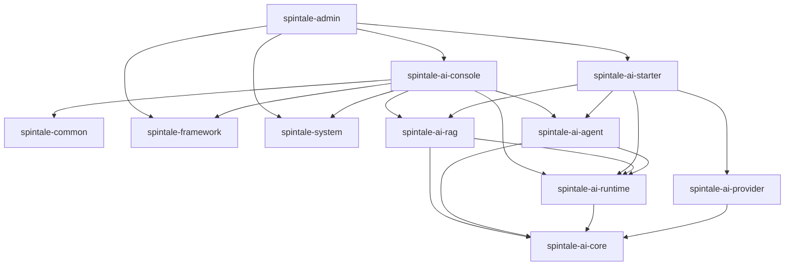

# SpinTale AI 目标结构与直接依赖方案

## 1. 核心结论

当前 AI 模块最需要治理的是 **直接依赖关系**，不是 Maven 传递依赖。后续所有依赖图、依赖表、模块边界都只讨论 `pom.xml` 中显式声明的直接依赖。

推荐最终结构：保留 7 个模块，但按 **5 个 AI 主体模块 + 2 个集成模块** 理解，而不是把它们放在同一层。

```text
SpinTale
├── spintale-admin
├── spintale-common
├── spintale-framework
├── spintale-system
│
├── AI 主体层
│   ├── spintale-ai-core
│   ├── spintale-ai-runtime
│   ├── spintale-ai-provider
│   ├── spintale-ai-rag
│   └── spintale-ai-agent
└── AI 集成层
    ├── spintale-ai-starter
    └── spintale-ai-console
```

关键决策：

1. `spintale-ai-core` 只放核心抽象，不直接依赖 Spring Boot、LangChain4j、RuoYi、数据库、缓存、可观测 SDK。
2. `spintale-ai-runtime` 是统一执行入口，承接 ChatClient、AdvisorChain、调用上下文、运行记录、超时、重试、fallback、成本统计。
3. `spintale-ai-provider` 只实现模型供应商适配，不直接依赖 Runtime、RAG、Agent、Console、Starter。
4. `spintale-ai-rag` 只做知识库和 RAG，不直接依赖 Agent，不直接依赖 Console。
5. `spintale-ai-agent` 只做 Agent、Tool、Memory、Workflow，不直接依赖 RAG，不直接依赖 Console。
6. `spintale-ai-starter` 只做自动配置，不依赖 RuoYi。
7. `spintale-ai-console` 是唯一允许直接依赖 RuoYi 模块的 AI 模块；默认不直接依赖 provider，模型配置和模型状态通过 runtime 暴露的管理门面访问。
8. `spintale-ai-api` 不建议长期保留为独立模块，最终应拆分到 `core` 和 `runtime`。

---

## 2. 当前直接依赖关系诊断

以下是当前 AI 模块的直接依赖关系，只统计 `pom.xml` 显式声明的项目内模块依赖。

```text
spintale-ai-core
└── 无项目内模块依赖

spintale-ai-api
└── spintale-ai-core

spintale-ai-retrieval
├── spintale-ai-core
└── spintale-ai-api

spintale-ai-agent
├── spintale-ai-core
├── spintale-ai-api
└── spintale-ai-retrieval

spintale-ai-providers
├── spintale-ai-core
└── spintale-ai-api

spintale-ai-starter
├── spintale-ai-core
├── spintale-ai-api
├── spintale-ai-agent
├── spintale-ai-retrieval
└── spintale-ai-providers

spintale-admin
└── spintale-ai-starter
```

### 2.1 当前直接依赖问题

| 问题 | 当前表现 | 影响 |
| --- | --- | --- |
| `core` 依赖外部框架过重 | 直接引入 Spring Web、Resilience4j、Caffeine、OpenTelemetry SDK/exporter | 核心抽象无法独立复用，底层被框架污染 |
| `api` 成为中间枢纽 | `retrieval`、`agent`、`providers` 都直接依赖 `api` | API 层职责变重，容易继续堆 facade、advisor、provider glue |
| `agent` 直接依赖 `retrieval` | `spintale-ai-agent -> spintale-ai-retrieval` | Agent 与 RAG 绑死，后续 Tool 化、插件化困难 |
| `providers` 直接依赖 `api` | `spintale-ai-providers -> spintale-ai-api` | Provider 不再是底层模型适配，而是依赖上层 API |
| `starter` 显式依赖所有 AI 模块 | starter 直接依赖 core/api/agent/retrieval/providers | 自动配置层变成“大杂烩聚合层”，边界不清 |
| 缺少 `runtime` | Chat、RAG、Agent 调用缺少统一执行入口 | trace、cost、retry、fallback、stream 生命周期分散 |
| 缺少 `console` | RuoYi 集成没有单独边界模块 | 权限、日志、返回体容易侵入 starter 或能力模块 |

---

## 3. 基于外部 AI 框架经验的目标结构

### 3.1 目标态设计来源

目标结构不是按当前目录简单改名，而是根据外部 AI 框架的成熟设计提炼后重新划分。

| 参考框架 | 值得采纳的结构 | SpinTale 目标结构决策 | 需要避免 |
| --- | --- | --- | --- |
| Spring AI | `ChatClient`、Advisor、VectorStore、Observability、Spring Boot Starter | 建立 `spintale-ai-runtime` 承接 Client/Advisor/Trace；建立 `spintale-ai-starter` 承接 AutoConfiguration | Spring AI 类型进入 `core`，starter 承载业务 Controller |
| LangChain4j | Java 模型适配、AI Service、Tool、Memory、RAG 抽象 | `spintale-ai-provider` 内部可用 LangChain4j 适配模型；`agent.tool` 借鉴 Tool schema | 业务层、core/runtime 公共接口直接暴露 LangChain4j 类型 |
| Semantic Kernel | Kernel、Plugin、Function、工具权限边界 | `spintale-ai-agent` 内建立 ToolPlugin/ToolDefinition/ToolInvocation；工具增加权限码和风险等级 | 初期做复杂 Planner 或把插件系统做成大平台 |
| LlamaIndex | ingestion、metadata、index、retriever、response synthesis | `spintale-ai-rag` 按 `document/ingestion/chunk/retrieval/citation/eval` 组织 | 直接照搬过多 Python 生态抽象 |
| Haystack | Component + Pipeline、Retriever/Generator/Evaluator 分离 | RAG 内部明确 ingestion/retrieval/answer/eval 组件边界 | 过早做可视化 pipeline 和组件市场 |
| Dify | 模型、知识库、应用、工作流、日志、反馈控制台 | `spintale-ai-console` 做 RuoYi AI 控制台，承载模型、知识库、Agent、日志、成本、反馈 | 把 Console 放进 starter，或一开始做完整低代码平台 |
| RAGFlow | 文档理解、chunk 可视化、citation、检索可解释性 | RAG 强化 document/chunk/citation；Console 提供 chunk/引用/检索调试视图 | 目标态一开始绑定 OCR/版面模型等重依赖 |
| OpenAI Agents SDK | AgentRun、ToolCall、Handoff、Guardrail、Tracing | `agent.run/guardrail/tool` 和 `runtime.observability` 成为一等结构 | 多 Agent/handoff 先行，导致调试和成本失控 |
| LangGraph | checkpoint、human-in-the-loop、durable execution、memory | `agent.checkpoint`、`agent.approval` 作为目标包；Temporal 作为可选适配 | 主 Agent 模块强绑定状态图引擎或 Temporal |

由此得到的结构原则：

1. Spring 生态能力只进入 `starter/console/runtime`，不进入 `core`。
2. 模型 SDK 和 LangChain4j 只进入 `provider` 或特定 adapter，不进入公共接口。
3. RAG 独立成知识库模块，不再只叫 retrieval。
4. Agent 独立成工具、记忆、审批、checkpoint 模块，不直接依赖 RAG。
5. Console 独立承载 RuoYi 集成，不污染 starter 和底层能力。
6. Evaluation 先作为 RAG/Runtime/Agent 的目标能力包，成熟后再考虑独立模块。

### 3.2 最终直接依赖树

以下依赖全部表示 `pom.xml` 中应该显式声明的直接依赖，不包含 Maven 传递依赖。

```text
spintale-ai-core
└── 无项目内模块依赖

spintale-ai-runtime
└── spintale-ai-core

spintale-ai-provider
└── spintale-ai-core

spintale-ai-rag
├── spintale-ai-core
└── spintale-ai-runtime

spintale-ai-agent
├── spintale-ai-core
└── spintale-ai-runtime

spintale-ai-starter
├── spintale-ai-runtime
├── spintale-ai-provider
├── spintale-ai-rag
└── spintale-ai-agent

spintale-ai-console
├── spintale-ai-runtime
├── spintale-ai-rag
├── spintale-ai-agent
├── spintale-common
├── spintale-framework
└── spintale-system

spintale-admin
├── spintale-framework
├── spintale-system
├── spintale-ai-starter
└── spintale-ai-console
```

说明：

1. `spintale-ai-provider` 不直接依赖 `runtime`，避免 provider 和 runtime 形成互相感知。Provider 只实现 `core` 中定义的模型接口。
2. `spintale-ai-rag` 不直接依赖 `provider`。RAG 需要 embedding、rerank、chat 时，通过 `core` 抽象接口和 `runtime` 执行入口获得能力。
3. `spintale-ai-agent` 不直接依赖 `provider`。Agent 调模型统一走 `runtime`。
4. `spintale-ai-agent` 不直接依赖 `rag`。Agent 需要知识库能力时，将 RAG 暴露为 Tool，由运行期注入。
5. `spintale-ai-starter` 可以直接依赖 `provider/rag/agent/runtime`，因为它负责自动装配。
6. `spintale-ai-console` 可以直接依赖 RuoYi 模块，因为它就是 RuoYi 集成层。
7. `spintale-ai-console` 默认不直接依赖 `provider`。模型供应商配置、模型能力目录、健康状态应通过 `runtime` 的管理门面或查询服务暴露给 console。

### 3.3 目标直接依赖图



### 3.4 目标文件结构框架

项目结构不要继续按“技术杂物包”组织，例如 `api`、`infrastructure`、`common`、`provider/common`。更合理的结构是：Maven 模块按能力边界拆分，模块内部按 `api/domain/application/infrastructure` 或更轻量的 `contract/runtime/adapter` 分层。

推荐主线结构：

```text
SpinTale
├── spintale-admin
│   └── 只做启动入口、全局配置、RuoYi 原有 Controller 聚合
├── spintale-common
├── spintale-framework
├── spintale-system
│
├── AI 主体层
│   ├── spintale-ai-core
│   │   └── AI 稳定抽象和值对象，不放 Spring Bean
│   ├── spintale-ai-runtime
│   │   └── AI 统一执行入口、Advisor、Trace、Cost、Policy、Prompt、模型管理门面
│   ├── spintale-ai-provider
│   │   └── 模型供应商适配，OpenAI/Ollama/OpenAI-compatible/local
│   ├── spintale-ai-rag
│   │   └── 知识库、文档、chunk、retrieval、citation、RAG eval
│   └── spintale-ai-agent
│       └── Agent、Tool、Memory、Guardrail、Approval、Checkpoint
└── AI 集成层
    ├── spintale-ai-starter
    │   └── Spring Boot 自动配置和 properties，不放 Web Controller
    └── spintale-ai-console
        └── RuoYi AI 管理控制台，Controller/VO/权限/操作日志/Mapper
```

目标态不建议新增过多 Maven 模块。Prompt、Guardrail、Evaluation、Workflow、Memory 先作为包存在；只有满足以下条件才拆模块：

1. 需要独立发布或独立启停。
2. 依赖非常重，且不是所有使用方都需要。
3. 需要替换多种实现，例如 Temporal、本地 Workflow、不同向量库。
4. 被多个上层模块复用，继续放在某个能力模块会形成反向依赖。

因此目标态不推荐新增 `spintale-ai-prompt`、`spintale-ai-memory`、`spintale-ai-workflow`。可以预留两个后续可选模块：

| 可选模块 | 触发条件 | 直接依赖 |
| --- | --- | --- |
| `spintale-ai-evaluation` | RAG/Agent/Prompt 评估开始独立产品化 | `runtime, rag, agent, core` |
| `spintale-ai-agent-temporal` | Temporal 成为可替换的长任务执行后端 | `agent, runtime, core` |

### 3.5 各模块内部目标包结构

#### `spintale-ai-core`

```text
com.spintale.ai.core
├── chat
│   ├── ChatRequest
│   ├── ChatResponse
│   ├── ChatMessage
│   └── ChatOptions
├── model
│   ├── ChatModel
│   ├── EmbeddingModel
│   ├── RerankModel
│   └── ModelCapability
├── tool
│   ├── ToolDefinition
│   ├── ToolCall
│   └── ToolResult
├── memory
│   └── MemoryEntry
├── usage
│   └── TokenUsage
└── error
    └── AiException
```

`core` 只保留稳定契约和值对象。当前 `core.metrics`、`core.observability`、`core.service`、`core.provider` 都不应长期放在 core。

#### `spintale-ai-runtime`

```text
com.spintale.ai.runtime
├── client
│   ├── ChatClient
│   ├── StreamingChatClient
│   ├── EmbeddingClient
│   └── RerankClient
├── execution
│   ├── AiExecutor
│   ├── AiRunContext
│   ├── AiRunResult
│   └── AiRunLedger
├── advisor
│   ├── Advisor
│   ├── AdvisorChain
│   ├── SafetyAdvisor
│   ├── ObservabilityAdvisor
│   └── SemanticCacheAdvisor
├── policy
│   ├── TimeoutPolicy
│   ├── RetryPolicy
│   ├── FallbackPolicy
│   └── BudgetPolicy
├── prompt
│   ├── PromptTemplate
│   ├── PromptRenderer
│   └── MessageBuilder
├── routing
│   ├── ModelRouter
│   └── RoutingDecision
├── model
│   ├── ModelCatalogQueryService
│   ├── ProviderStatusService
│   └── ModelAdminFacade
└── observability
    ├── AiSpan
    ├── CostRecorder
    └── TraceRecorder
```

`runtime` 是项目后续的核心执行层。ChatClient、Advisor、Pipeline、Facade、Prompt 渲染都归属 runtime。

#### `spintale-ai-provider`

```text
com.spintale.ai.provider
├── catalog
│   ├── ModelCatalog
│   ├── ProviderCatalog
│   └── ModelPrice
├── openai
│   ├── OpenAiChatModelAdapter
│   └── OpenAiEmbeddingModelAdapter
├── compatible
│   └── OpenAiCompatibleProvider
├── ollama
│   └── OllamaModelAdapter
├── local
│   └── LocalModelAdapter
└── langchain4j
    ├── LangChain4jChatModelAdapter
    └── LangChain4jMessageMapper
```

provider 只做“模型 SDK 到 core 抽象”的适配。模型路由归属 `runtime.routing`，因为路由是执行期策略，不是供应商适配。

#### `spintale-ai-rag`

```text
com.spintale.ai.rag
├── knowledge
│   ├── KnowledgeBase
│   └── KnowledgeBaseService
├── document
│   ├── Document
│   ├── DocumentStatus
│   └── DocumentVersion
├── ingestion
│   ├── DocumentParser
│   ├── DocumentCleaner
│   ├── DocumentChunker
│   └── IngestionPipeline
├── chunk
│   ├── DocumentChunk
│   └── ChunkMetadata
├── retrieval
│   ├── RetrievalService
│   ├── RetrievalQuery
│   ├── RetrievalResult
│   └── RerankService
├── vector
│   ├── VectorStore
│   └── VectorIndexService
├── citation
│   ├── Citation
│   └── CitationResolver
├── eval
│   └── RagEvaluationService
└── adapter
    └── milvus
        └── MilvusVectorStore
```

RAG 不再叫 retrieval，因为 retrieval 只是 RAG 的一个步骤。RAG 内部也不要让 `advisor` 成为主结构；`RagAdvisor` 可以保留，但它只是 runtime advisor 的一个实现，不应代表 RAG 主功能。

#### `spintale-ai-agent`

```text
com.spintale.ai.agent
├── definition
│   ├── AgentDefinition
│   └── AgentProfile
├── run
│   ├── AgentRun
│   ├── AgentStep
│   └── AgentRunService
├── react
│   ├── ReActAgent
│   └── ReActLoop
├── tool
│   ├── ToolRegistry
│   ├── ToolExecutor
│   ├── ToolInvocation
│   ├── ToolRiskLevel
│   └── builtin
├── memory
│   ├── ShortTermMemory
│   ├── SummaryMemory
│   └── LongTermMemory
├── guardrail
│   ├── InputGuardrail
│   ├── OutputGuardrail
│   └── ToolGuardrail
├── approval
│   └── HumanApprovalService
├── checkpoint
│   └── AgentCheckpoint
└── workflow
    ├── WorkflowEngine
    └── LocalWorkflowEngine
```

Agent 模块不应该直接依赖 RAG。知识库查询应注册成 Tool，例如 `KnowledgeSearchTool`，由 starter 或 console 在运行期组装。

Temporal 不建议直接成为主 Agent 模块的必需依赖。目标结构中，Temporal 只能作为 `agent.workflow.temporal` 可选适配；如果它的依赖和部署成本继续变重，再独立为 `spintale-ai-agent-temporal`。

#### `spintale-ai-starter`

```text
com.spintale.ai.starter
├── autoconfigure
│   ├── AiRuntimeAutoConfiguration
│   ├── AiProviderAutoConfiguration
│   ├── AiRagAutoConfiguration
│   ├── AiAgentAutoConfiguration
│   └── AiObservabilityAutoConfiguration
├── properties
│   ├── AiProperties
│   ├── ProviderProperties
│   ├── RagProperties
│   ├── AgentProperties
│   └── TelemetryProperties
├── condition
│   └── ConditionalOnAiEnabled
└── adapter
    ├── telemetry
    ├── cache
    └── persistence
```

starter 不放 `web.controller`，也不返回 `AjaxResult`、`ResponseEntity`。所有 HTTP Controller、RuoYi 返回体、权限注解都归属 `spintale-ai-console`。

#### `spintale-ai-console`

```text
com.spintale.ai.console
├── controller
│   ├── AiModelController
│   ├── AiKnowledgeController
│   ├── AiDocumentController
│   ├── AiAgentController
│   ├── AiToolController
│   ├── AiRunController
│   └── AiEvalController
├── application
│   ├── ModelAdminService
│   ├── KnowledgeAdminService
│   ├── AgentAdminService
│   └── RunQueryService
├── domain
│   └── RuoYi 持久化实体或查询对象
├── mapper
│   └── MyBatis Mapper
├── dto
├── vo
├── convert
└── permission
```

console 是唯一可以直接出现 RuoYi 类型的位置，例如 `BaseController`、`AjaxResult`、`@PreAuthorize`、`@Log`、`SysOperLog`。

### 3.6 目标功能归属

| 功能域 | 目标模块 | 目标包 | 可直接依赖 | 禁止直接依赖 |
| --- | --- | --- | --- | --- |
| Chat/Streaming Client | `spintale-ai-runtime` | `runtime.client` | `core` | `provider/rag/agent/console` |
| Advisor/Interceptor | `spintale-ai-runtime` | `runtime.advisor` | `core` | `console/RuoYi` |
| Prompt 模板与渲染 | `spintale-ai-runtime` | `runtime.prompt` | `core` | `provider/rag/agent` |
| 模型路由与 fallback | `spintale-ai-runtime` | `runtime.routing`、`runtime.policy` | `core` | `provider` |
| Token/Cost/Trace | `spintale-ai-runtime` | `runtime.observability` | `core` | `console/RuoYi` |
| 模型 SDK 适配 | `spintale-ai-provider` | `provider.openai`、`provider.ollama`、`provider.langchain4j` | `core` | `runtime/rag/agent` |
| 模型能力目录 | `spintale-ai-provider` | `provider.catalog` | `core` | `console/RuoYi` |
| 知识库 | `spintale-ai-rag` | `rag.knowledge` | `runtime/core` | `agent/provider/console` |
| 文档解析和索引 | `spintale-ai-rag` | `rag.document`、`rag.ingestion`、`rag.vector` | `runtime/core` | `agent/console` |
| 检索、重排、引用 | `spintale-ai-rag` | `rag.retrieval`、`rag.citation` | `runtime/core` | `provider/agent` |
| Agent 执行 | `spintale-ai-agent` | `agent.run`、`agent.react` | `runtime/core` | `rag/provider/console` |
| Tool/Plugin | `spintale-ai-agent` | `agent.tool` | `runtime/core` | `console/RuoYi` |
| Memory | `spintale-ai-agent` | `agent.memory` | `runtime/core` | `rag/provider` |
| Guardrail/Approval/Checkpoint | `spintale-ai-agent` | `agent.guardrail`、`agent.approval`、`agent.checkpoint` | `runtime/core` | `console/RuoYi` |
| 自动配置 | `spintale-ai-starter` | `starter.autoconfigure` | `runtime/provider/rag/agent` | `console/RuoYi` |
| 配置属性 | `spintale-ai-starter` | `starter.properties` | 各 AI 能力模块 | `console/RuoYi` |
| AI 管理接口 | `spintale-ai-console` | `console.controller` | `runtime/rag/agent/RuoYi` | `provider`、被底层模块依赖 |
| RuoYi 菜单/权限/日志 | `spintale-ai-console` | `console.permission`、`console.application` | `spintale-common/framework/system` | `core/runtime/provider/rag/agent` |

### 3.7 目标直接依赖关系

主线直接依赖保持简单：

```text
spintale-ai-core
└── none

spintale-ai-runtime
└── spintale-ai-core

spintale-ai-provider
└── spintale-ai-core

spintale-ai-rag
├── spintale-ai-core
└── spintale-ai-runtime

spintale-ai-agent
├── spintale-ai-core
└── spintale-ai-runtime

spintale-ai-starter
├── spintale-ai-runtime
├── spintale-ai-provider
├── spintale-ai-rag
└── spintale-ai-agent

spintale-ai-console
├── spintale-ai-runtime
├── spintale-ai-rag
├── spintale-ai-agent
├── spintale-common
├── spintale-framework
└── spintale-system

spintale-admin
├── spintale-framework
├── spintale-system
├── spintale-ai-starter
└── spintale-ai-console
```

直接依赖目标：

1. `provider` 不依赖 `runtime`，因为 provider 只是能力实现。
2. `runtime` 不依赖 `provider`，避免 runtime 和 provider 双向感知；由 starter 负责 Bean 装配。
3. `rag` 不依赖 `provider`，所有模型调用走 runtime。
4. `agent` 不依赖 `rag`，知识库能力注册成 Tool。
5. `starter` 不依赖 RuoYi。
6. `console` 不直接依赖 provider，只通过 runtime 管理门面访问模型配置、模型目录、健康状态。
7. `console` 不被任何 AI 底层模块依赖。
8. `admin` 只聚合 starter 和 console，不承载 AI 业务代码。

---

## 4. 模块职责与直接依赖规则

### 4.1 `spintale-ai-core`

定位：AI 最底层抽象。

直接依赖：

```text
无项目内模块依赖
```

允许外部依赖：

```text
JDK
Jackson annotations 或极少量无框架工具
Lombok provided，可选
```

禁止外部依赖：

```text
Spring Boot
Spring Web
LangChain4j
OpenTelemetry SDK/exporter
Resilience4j
Redis
Milvus
RuoYi
数据库访问框架
```

职责：

1. `ChatRequest`、`ChatResponse`、`ChatMessage`、`TokenUsage`。
2. `ChatModel`、`EmbeddingModel`、`RerankModel`、`VectorStore` 等接口。
3. `ToolDefinition`、`ToolCall`、`MemoryEntry` 基础模型。
4. AI 异常、枚举、常量。

目标边界：

1. `core` 不包含 Spring、Resilience4j、OpenTelemetry SDK。
2. 稳定抽象归属 `core`。
3. `core` 不出现任何 `@Component`、`@Service`、`@Configuration`、`@RestController`。

### 4.2 `spintale-ai-runtime`

定位：AI 统一执行入口。

直接依赖：

```text
spintale-ai-runtime
└── spintale-ai-core
```

职责：

1. `ChatClient`、`EmbeddingClient`、`RerankClient`。
2. `AiRunContext`、`AiRunResult`。
3. `AdvisorChain`、`Advisor`、`Interceptor`。
4. `AiExecutor`、`StreamingExecutor`。
5. timeout、retry、fallback、budget。
6. token、cost、latency、trace span、run ledger。
7. 模型目录、供应商状态、路由策略的查询和管理门面。
8. 轻量 observability 和 evaluation 基础能力。

目标边界：

1. ChatClient、Advisor、Facade 归属 runtime。
2. Resilience4j、OpenTelemetry 相关运行时逻辑归属 runtime 或 starter。
3. Chat、RAG、Agent 统一走 runtime，不各自直接调用 provider SDK。

### 4.3 `spintale-ai-provider`

定位：模型供应商适配。

直接依赖：

```text
spintale-ai-provider
└── spintale-ai-core
```

职责：

1. OpenAI、OpenAI-compatible、Ollama、Azure、本地模型适配。
2. Embedding provider。
3. Rerank provider。
4. Model capability。
5. Provider health check。

禁止：

```text
spintale-ai-provider -> spintale-ai-runtime
spintale-ai-provider -> spintale-ai-rag
spintale-ai-provider -> spintale-ai-agent
spintale-ai-provider -> spintale-ai-starter
spintale-ai-provider -> spintale-ai-console
spintale-ai-provider -> spintale-ai-api
```

目标边界：

1. 不依赖 `spintale-ai-api`。
2. Provider 实现 `core` 中的 `ChatModel`、`EmbeddingModel`、`RerankModel`。
3. Provider 不知道 RAG、Agent、Console 的存在。

### 4.4 `spintale-ai-rag`

定位：知识库与 RAG。

直接依赖：

```text
spintale-ai-rag
├── spintale-ai-core
└── spintale-ai-runtime
```

职责：

1. 知识库管理领域模型。
2. 文档解析、清洗、chunk、metadata。
3. embedding 入库和索引任务。
4. 检索、hybrid search、rerank、context build。
5. citation answer。
6. RAG trace 和 RAG eval。

禁止：

```text
spintale-ai-rag -> spintale-ai-provider
spintale-ai-rag -> spintale-ai-agent
spintale-ai-rag -> spintale-ai-console
spintale-ai-rag -> spintale-ai-starter
spintale-ai-rag -> spintale-ai-api
```

目标边界：

1. 模块名使用 `spintale-ai-rag`，不再使用 retrieval 表达整个知识库能力。
2. 不依赖 `spintale-ai-api`。
3. RAG 使用 runtime 的 client 调用 embedding/rerank/chat，而不是直接依赖 provider。
4. RAG 能力若要给 Agent 使用，通过 `ToolDefinition` 暴露，不做模块直接依赖。

### 4.5 `spintale-ai-agent`

定位：Agent、Tool、Memory、Workflow。

直接依赖：

```text
spintale-ai-agent
├── spintale-ai-core
└── spintale-ai-runtime
```

职责：

1. AgentDefinition、AgentRun、AgentStep。
2. Planner、Executor、Guardrail。
3. ToolRegistry、ToolExecutor、ToolPermission。
4. Memory：short-term、summary、long-term。
5. Workflow：轻量流程编排。

禁止：

```text
spintale-ai-agent -> spintale-ai-provider
spintale-ai-agent -> spintale-ai-rag
spintale-ai-agent -> spintale-ai-console
spintale-ai-agent -> spintale-ai-starter
spintale-ai-agent -> spintale-ai-api
```

目标边界：

1. 不依赖 `spintale-ai-rag`。
2. 不依赖 `spintale-ai-api`。
3. Agent 调模型走 runtime。
4. Agent 使用 RAG 时通过 Tool 调用，由 starter 或 console 在运行期注册工具。

### 4.6 `spintale-ai-starter`

定位：Spring Boot 自动装配。

直接依赖：

```text
spintale-ai-starter
├── spintale-ai-runtime
├── spintale-ai-provider
├── spintale-ai-rag
└── spintale-ai-agent
```

职责：

1. `@AutoConfiguration`。
2. `@ConfigurationProperties`。
3. 自动装配 provider、runtime、rag、agent。
4. 注册默认 advisor chain。
5. 注册默认 Tool、Memory、VectorStore。

禁止：

```text
spintale-ai-starter -> spintale-ai-console
spintale-ai-starter -> spintale-common
spintale-ai-starter -> spintale-framework
spintale-ai-starter -> spintale-system
spintale-ai-starter -> spintale-ai-api
```

目标边界：

1. 不包含 RuoYi 相关 Controller、`AjaxResult`、`SecurityUtils`、`@Log`。
2. 不再直接依赖 `core`，通过 runtime/provider/rag/agent 的直接依赖即可获得传递依赖。若确实直接使用 core 类型，才显式声明 core。
3. starter 不做业务管理接口。

### 4.7 `spintale-ai-console`

定位：AI 控制台，RuoYi 集成层。

直接依赖：

```text
spintale-ai-console
├── spintale-ai-runtime
├── spintale-ai-rag
├── spintale-ai-agent
├── spintale-common
├── spintale-framework
└── spintale-system
```

职责：

1. AI 管理端 Controller。
2. RuoYi 权限、菜单、日志、返回体适配。
3. 模型与 Provider 配置管理，通过 runtime 管理门面访问模型目录、路由策略和健康状态。
4. 知识库管理。
5. 文档索引任务管理。
6. Agent/Tool/Memory 管理。
7. Run history、trace、cost、eval 查询。

禁止：

```text
任何 AI 底层模块 -> spintale-ai-console
spintale-ai-console -> spintale-ai-starter
```

目标边界：

1. 所有 RuoYi 强绑定逻辑只允许放在 console。
2. console 可以直接依赖 Runtime/RAG/Agent，因为它是控制台编排层。
3. console 不写底层模型调用和 RAG pipeline 实现，只做管理和编排。
4. console 不直接依赖 Provider；Provider 配置、模型目录、健康状态由 runtime 的管理门面聚合后暴露给 console。

---

## 5. 目标依赖边界

本节只描述目标态，不描述改造步骤。

### 5.1 模块直接依赖矩阵

| 模块 | 允许的项目内直接依赖 | 禁止的项目内直接依赖 |
| --- | --- | --- |
| `spintale-ai-core` | 无 | 所有项目内模块 |
| `spintale-ai-runtime` | `spintale-ai-core` | `provider/rag/agent/starter/console/RuoYi` |
| `spintale-ai-provider` | `spintale-ai-core` | `runtime/rag/agent/starter/console/RuoYi` |
| `spintale-ai-rag` | `spintale-ai-core`、`spintale-ai-runtime` | `provider/agent/starter/console/RuoYi` |
| `spintale-ai-agent` | `spintale-ai-core`、`spintale-ai-runtime` | `provider/rag/starter/console/RuoYi` |
| `spintale-ai-starter` | `runtime/provider/rag/agent` | `console/spintale-common/spintale-framework/spintale-system` |
| `spintale-ai-console` | `runtime/rag/agent/spintale-common/spintale-framework/spintale-system` | `provider/starter` |
| `spintale-admin` | `spintale-framework/spintale-system/spintale-ai-starter/spintale-ai-console` | AI 底层业务实现类 |

### 5.2 外部依赖归属

| 外部依赖类型 | 目标归属 | 不应出现的位置 |
| --- | --- | --- |
| Spring Boot AutoConfiguration | `spintale-ai-starter` | `core/provider/rag/agent` 的核心包 |
| Spring Web Controller | `spintale-ai-console` | `starter/core/runtime/provider/rag/agent` |
| RuoYi `AjaxResult/BaseController/@Log/@PreAuthorize` | `spintale-ai-console` | 所有 AI 底层模块 |
| LangChain4j SDK | `spintale-ai-provider`，少量可在 `rag` 文档处理适配中使用 | `core` 公共接口 |
| OpenAI/Ollama SDK | `spintale-ai-provider` | `runtime/rag/agent/console` |
| Resilience4j | `spintale-ai-runtime` 或 `starter` 配置层 | `core` |
| OpenTelemetry SDK/exporter | `spintale-ai-starter` | `core` |
| OpenTelemetry API | `spintale-ai-runtime` | `core` 尽量不放 |
| Caffeine | `spintale-ai-runtime` 或 `agent.memory` 实现 | `core` |
| Redisson | `starter` 的持久化适配，或后续独立 redis adapter | `core/agent` 核心接口 |
| Temporal | `agent.workflow.temporal` 可选适配，或后续 `spintale-ai-agent-temporal` | `agent` 主流程必需依赖 |
| Milvus SDK | `spintale-ai-rag.adapter.milvus` | `core/runtime/agent/console` |
| MyBatis Mapper | `spintale-ai-console` 或 RAG/Agent 自己的持久化实现包 | `core` |

### 5.3 功能跨模块关系

```text
普通 Chat:
console/admin -> runtime -> core(ChatModel) -> provider implementation

RAG 问答:
console/admin -> rag -> runtime -> core(ChatModel/EmbeddingModel/RerankModel) -> provider implementation

Agent 执行:
console/admin -> agent -> runtime -> core(ChatModel/ToolDefinition) -> provider implementation

Agent 使用知识库:
agent -> ToolDefinition("knowledge_search") -> runtime tool execution -> rag service

模型配置管理:
console -> runtime model admin facade -> provider catalog / routing policy

运行日志:
runtime 生成 run/span/cost
console 只查询和展示 run/span/cost
```

关键点：

1. `runtime` 面向 `core` 抽象调用模型，不直接依赖 provider 模块。
2. `starter` 负责把 provider 实现装配给 runtime。
3. `rag` 和 `agent` 都可以使用 runtime，但二者不互相直接依赖。
4. `console` 可以编排 Runtime、RAG、Agent，并通过 runtime 查询模型目录和供应商状态；底层模块不能依赖 console。
5. `admin` 是应用启动和聚合入口，不承载 AI 能力实现。

---

## 6. 外部 AI 框架优缺点与采纳策略

本节只提炼对 SpinTale 有用的结构设计，不建议直接照搬任何一个框架。当前项目是 RuoYi 后台系统加 Java AI 能力，目标应是“可嵌入、可治理、可观测、可渐进升级”，而不是一次性做成完整 LLMOps 平台。

### 6.1 Spring AI

优点：

1. 与 Spring Boot、AutoConfiguration、Actuator、Micrometer 体系天然适配。
2. `ChatClient`、Advisor、VectorStore、ETL、Observability 这些抽象适合 Java 后台系统。
3. 对多模型供应商和向量库有统一接入方式，适合做 starter 自动装配。

缺点：

1. API 仍在快速演进，直接把 Spring AI 类型暴露到业务接口会提高后续升级成本。
2. 过度依赖 Spring 上下文，容易让 core 被 `@Component`、`@Configuration`、starter 配置污染。
3. RAG 的文档解析、复杂 chunk、引用可视化、评估闭环仍需要项目自己建设。

SpinTale 采纳策略：

1. 采纳 `ChatClient + AdvisorChain + Observability` 思路，落到 `spintale-ai-runtime`。
2. 采纳 Spring Boot 自动装配方式，落到 `spintale-ai-starter`。
3. 不把 Spring AI 类型放进 `spintale-ai-core` 的公共接口。
4. 若未来直接引入 Spring AI，应放在 `runtime/starter/provider`，不要下沉到 core。

### 6.2 LangChain4j

优点：

1. Java 生态更贴近当前技术栈，AI Service、Tool、Memory、RAG 抽象成熟。
2. 供应商适配多，适合作为部分 provider 的底层实现参考。
3. 对“Java 方法暴露为工具调用”的体验较好，适合借鉴 Tool 定义。

缺点：

1. 如果业务层直接依赖 LangChain4j 注解和类型，会被框架模型锁死。
2. Agent、RAG、Memory 组合容易越写越厚，模块边界容易退化为一个大 service。
3. 成本、审计、权限、敏感信息脱敏、企业级运行日志仍需要项目自建。

SpinTale 采纳策略：

1. `spintale-ai-provider` 可以内部使用 LangChain4j 适配模型，但不能向 core/runtime 泄漏 LangChain4j 类型。
2. 借鉴 `AI Service` 的声明式接口，但 SpinTale 自己定义 `ToolDefinition`、`ToolExecutor`、`AgentDefinition`。
3. Tool 必须补充 RuoYi 场景需要的 `permissionCode`、`riskLevel`、`auditRequired`、`humanApprovalRequired`。

### 6.3 Semantic Kernel

优点：

1. Kernel、Plugin、Function 的分层清晰，适合企业系统把已有服务封装成 AI 工具。
2. Plugin 可以承接权限、参数 schema、函数描述、执行上下文。
3. Planner 和 Agent 的概念适合复杂任务编排的长期方向。

缺点：

1. Java 不是最强势生态，直接引入收益不如借鉴结构。
2. Planner/Plugin 一次性做全会显著增加复杂度。
3. 对 RuoYi 权限、审计、菜单、租户隔离仍需要本地化改造。

SpinTale 采纳策略：

1. 采纳 Plugin/Function 思路，建立 `ToolPlugin`、`ToolDefinition`、`ToolInvocation`。
2. Agent 初期不要做复杂 Planner，先做单 Agent + Tool Loop + 审批。
3. 高风险工具必须经过 RuoYi 权限校验和人工确认。

### 6.4 LlamaIndex

优点：

1. 文档 ingestion、metadata、index、retriever、rerank、response synthesis 的链路完整。
2. 对 RAG 评估、观测、数据源连接、文档解析的产品化经验丰富。
3. 强调数据和索引生命周期，适合知识库长期治理。

缺点：

1. Python 生态为主，直接集成到 Java/RuoYi 项目会增加运行时复杂度。
2. 抽象非常丰富，直接照搬会让当前项目模块过重。
3. 文档解析、索引、评估如果同时铺开，容易失控。

SpinTale 采纳策略：

1. 借鉴 ingestion pipeline：`parse -> clean -> chunk -> enrich metadata -> embed -> index`。
2. RAG chunk 必须保存 `sourceId`、`docVersion`、`pageNo`、`sectionPath`、`checksum`、`tokenCount`。
3. 先把 `spintale-ai-rag` 做成可追踪、可重建、可评估的知识库模块，再考虑复杂 workflow。

### 6.5 Haystack

优点：

1. Component + Pipeline 的数据流边界清晰，Retriever、Generator、Evaluator 分离明确。
2. 对 RAG pipeline 和组件级评估支持较好。
3. 适合借鉴“每个节点输入输出可观测”的设计。

缺点：

1. Python 生态为主，不适合作为 Java 主工程的直接依赖。
2. 可视化 pipeline 和组件市场不是当前目标主结构。
3. 过早引入图式 pipeline 会增加管理界面和调试复杂度。

SpinTale 采纳策略：

1. RAG 内部按 pipeline 步骤定义组件接口，但不把复杂可视化编排作为主结构。
2. 每次 RAG 查询记录 `query -> rewrite -> retrieve -> rerank -> context build -> generate -> citation`。
3. Evaluation 先支持 Retriever 命中率、答案引用覆盖率、无引用回答率，再扩展模型评分。

### 6.6 Dify

优点：

1. 控制台产品能力强：应用、知识库、模型供应商、工作流、插件、日志、反馈闭环完整。
2. 对非开发用户友好，适合作为 Console 功能规划参考。
3. 日志里包含模型、token、耗时、错误、用户反馈，适合运营排查。

缺点：

1. 它是完整 LLMOps 平台，不是可直接嵌入 RuoYi 的 Maven 模块。
2. 工作流、插件市场、多应用空间一次性照搬会超过当前项目承载能力。
3. 若完全模仿，会导致 `spintale-ai-console` 变成庞大低代码平台。

SpinTale 采纳策略：

1. Console 先做企业后台必需功能：模型配置、知识库、Agent、工具、运行日志、成本统计、反馈。
2. 暂不做复杂低代码 Workflow，先以配置化 Agent 和 RAG 应用为主。
3. 所有 Console 能力放在 `spintale-ai-console`，不要进入 `starter` 或能力模块。

### 6.7 RAGFlow

优点：

1. 深度文档理解、OCR、版面识别、表格处理、可视化 chunk、引用溯源是 RAG 系统的核心竞争力。
2. 强调从复杂非结构化文档中获得高质量 chunk。
3. citation 和 chunk 可解释性适合企业知识库场景。

缺点：

1. 系统较重，解析模型、OCR、队列、存储、索引链路都更复杂。
2. 对当前项目而言，直接追求深度文档理解会拖慢架构治理。
3. 私有化部署和资源要求更高。

SpinTale 采纳策略：

1. RAG 目标主结构支持 Text、Markdown、Word、PDF 的基础解析和 chunk 可追踪。
2. OCR、版面解析、表格结构化作为可选 adapter，不进入 RAG 核心接口。
3. 回答必须支持 citation，引用至少能定位到文档、版本、页码、chunk。

### 6.8 OpenAI Agents SDK

优点：

1. Agent、Tool、Handoff、Guardrail、Tracing 是一等概念。
2. 运行轨迹清晰，能记录模型调用、工具调用、handoff、guardrail、自定义事件。
3. Guardrail 设计适合生产环境控制输入、输出和工具调用风险。

缺点：

1. 与 OpenAI 生态绑定更强，且主要是 Python/TypeScript SDK。
2. 多 Agent、handoff、guardrail 全量引入会显著增加调试成本。
3. 企业权限、审计、菜单、数据权限仍需要结合 RuoYi 自建。

SpinTale 采纳策略：

1. `spintale-ai-agent` 建立 `AgentRun`、`AgentStep`、`ToolCall`、`Handoff` 的运行记录模型。
2. `spintale-ai-runtime` 提供统一 trace/span/run ledger，不让 Agent 自己散落日志。
3. Guardrail 先落地三类：输入脱敏、工具调用权限、输出合规检查。

### 6.9 LangGraph

优点：

1. durable execution、checkpoint、human-in-the-loop、memory、故障恢复是长任务 Agent 的关键能力。
2. 状态图适合明确步骤、可暂停、可恢复、需人工审批的任务。
3. 对复杂多步骤任务比普通 agent loop 更可控。

缺点：

1. Python/JavaScript 生态为主，不适合直接引入 Java 主工程。
2. 状态图会带来额外建模成本，简单问答和普通 RAG 不需要。
3. checkpoint、恢复、人工审批如果没有控制台配合，体验会很差。

SpinTale 采纳策略：

1. 短期不做完整 Graph 引擎，只预留 `AgentCheckpoint`、`WorkflowState`、`HumanApproval` 数据模型。
2. 高风险工具调用、长耗时任务、外部系统写操作才进入 checkpoint 流程。
3. 后续如果做 Workflow，也应放在 `spintale-ai-agent`，由 `spintale-ai-console` 管理，不影响 core/provider/rag。

### 6.10 框架经验到 SpinTale 模块的映射

| SpinTale 模块 | 借鉴对象 | 应采纳 | 应避免 |
| --- | --- | --- | --- |
| `spintale-ai-core` | Spring AI / LangChain4j 的底层模型抽象 | Chat、Embedding、Rerank、Tool、Memory 的稳定接口 | Spring、LangChain4j、RuoYi 类型进入 core |
| `spintale-ai-runtime` | Spring AI ChatClient、OpenAI Agents Tracing | 统一执行、Advisor、Trace、Cost、Retry、Fallback、Budget | 每个业务模块各自调用 provider SDK |
| `spintale-ai-provider` | LangChain4j Provider、Spring AI Model | 多供应商适配、能力目录、健康检查 | provider 反向依赖 RAG/Agent/Runtime |
| `spintale-ai-rag` | LlamaIndex、Haystack、RAGFlow | ingestion pipeline、metadata、hybrid search、rerank、citation、eval | 一开始就做复杂 OCR/低代码 pipeline |
| `spintale-ai-agent` | Semantic Kernel、OpenAI Agents SDK、LangGraph | Tool Plugin、Guardrail、AgentRun、Step Trace、Human Approval、Checkpoint | Agent 直接依赖 RAG 或直接写业务数据 |
| `spintale-ai-console` | Dify、RAGFlow Console | 模型、知识库、Agent、工具、日志、反馈、成本、评估界面 | 把 console 能力塞进 starter |
| `spintale-ai-starter` | Spring Boot Starter | 自动装配、条件配置、Bean 注册 | 承载业务编排和 RuoYi 控制器 |

### 6.11 对目标结构的补强

结合这些框架的经验，目标结构应满足：

1. `runtime` 是唯一执行入口，trace、cost、retry、fallback、stream、guardrail 都围绕它收敛。
2. `provider` 是模型适配层，负责供应商、模型能力、价格、上下文长度、流式支持和健康状态。
3. `rag` 是知识库能力层，负责文档生命周期、chunk 元数据、检索链路、引用溯源和 RAG 评估。
4. `agent` 是智能体能力层，负责 Tool schema、权限、风险等级、人工审批、运行轨迹和 checkpoint。
5. `console` 是 RuoYi AI 管理控制台，负责模型、知识库、Agent、日志、反馈、成本、评估、告警。
6. `starter` 是装配层，只负责条件配置和 Bean 注册，不承载 RuoYi 控制器或业务编排。

参考来源：

1. Spring AI Reference: https://docs.spring.io/spring-ai/reference/
2. LangChain4j Documentation: https://docs.langchain4j.dev/
3. Microsoft Semantic Kernel Documentation: https://learn.microsoft.com/en-us/semantic-kernel/
4. LlamaIndex Documentation: https://docs.llamaindex.ai/
5. Haystack Documentation: https://docs.haystack.deepset.ai/
6. Dify Documentation: https://docs.dify.ai/
7. RAGFlow GitHub: https://github.com/infiniflow/ragflow
8. OpenAI Agents SDK: https://openai.github.io/openai-agents-python/
9. LangGraph Documentation: https://docs.langchain.com/oss/python/langgraph/

---

## 7. 目标功能逻辑

### 7.1 Runtime 统一执行

缺点：

1. 当前缺少统一 run context。
2. Chat、RAG、Agent 调用链分散。
3. 运行日志、成本、trace、错误没有统一模型。

升级：

1. 新增 `AiRunContext`。
2. 新增 `AiRunLedger`。
3. 新增 `AiExecutor`、`StreamingExecutor`。
4. 新增 `AdvisorChain`。
5. 新增 `RetryPolicy`、`TimeoutPolicy`、`FallbackPolicy`、`BudgetPolicy`。

验收：

1. 所有 AI 调用都有 `runId` 和 `traceId`。
2. 所有 provider 调用都有 token/cost/latency。
3. RAG 和 Agent 都能写入 span。

### 7.2 Provider 能力目录

缺点：

1. 当前 provider 更像简单模型封装。
2. 缺少模型能力目录。
3. 缺少 fallback 和 health check。

升级：

1. `ModelCapability`：chat、streaming、toolCalling、embedding、rerank、vision、jsonSchema。
2. `ModelCatalog`：模型名称、上下文长度、成本、能力、启用状态。
3. `ProviderRegistry`：注册所有模型供应商。
4. `ModelRouter`：按任务类型选择模型。
5. `ProviderHealthCheck`：检测 provider 可用性。

验收：

1. 普通聊天、RAG、Agent、JSON 输出可以选择不同模型。
2. provider 不可用时可 fallback。
3. console 可通过 runtime 展示 provider 状态和模型能力。

### 7.3 RAG 重建

缺点：

1. retrieval 名称过窄。
2. 文档解析、chunk、metadata、索引、检索、回答没有完整 pipeline。
3. 缺少 citation。
4. 缺少检索调试和评估。

升级：

```text
Ingestion Pipeline:
Document -> Parser -> Cleaner -> Chunker -> Metadata -> Embedding -> Index

Retrieval Pipeline:
Query -> Rewrite -> Filter -> Hybrid Search -> Rerank -> Context Build

Answer Pipeline:
Context -> Prompt -> Generate -> Citation -> Grounding Check -> Response
```

验收：

1. 文档有状态机：uploaded、parsing、chunking、embedding、indexed、failed。
2. chunk 可查询、可调试。
3. 回答可返回 citation。
4. 检索过程可 trace。

### 7.4 Agent / Tool / Memory

缺点：

1. Agent 执行不可追踪。
2. Tool 没有完整风险治理。
3. Memory 与 RAG 边界不清。

升级：

1. `AgentDefinition`、`AgentRun`、`AgentStep`。
2. `ToolDefinition`：inputSchema、outputSchema、permissionCode、riskLevel、timeoutMs。
3. Tool 分级：L0 只读、L1 低风险写、L2 业务写、L3 高风险。
4. Memory 分层：short-term、summary、long-term。
5. Guardrail：输入保护、输出保护、工具参数保护。

验收：

1. Agent 每一步可追踪。
2. Tool 每次调用有审计。
3. 高风险 Tool 支持人工确认。
4. Memory 可过期、可删除、可检索。

### 7.5 Console 产品化

缺点：

1. AI 管理入口不清晰。
2. RuoYi 权限、日志、菜单容易侵入 starter。
3. 调用日志、成本、trace、评估缺少统一界面。

升级菜单：

```text
AI 控制台
├── 模型管理
│   ├── Provider 配置
│   ├── Model Catalog
│   └── 路由策略
├── Prompt 管理
├── 知识库
│   ├── 知识库列表
│   ├── 文档管理
│   ├── Chunk 查看
│   └── 检索调试
├── Agent
│   ├── Agent 配置
│   ├── Tool 管理
│   └── Run History
├── 运行观测
│   ├── 调用日志
│   ├── Trace 详情
│   └── 异常统计
├── 成本统计
└── 评估
```

---

## 8. 数据库规划

### 8.1 Runtime / 观测

```text
ai_run
ai_run_span
ai_cost_usage
```

### 8.2 Provider / 模型

```text
ai_provider_config
ai_model_config
ai_model_capability
ai_routing_policy
```

### 8.3 RAG

```text
ai_knowledge_base
ai_document
ai_document_chunk
ai_document_index_job
ai_retrieval_trace
```

### 8.4 Agent / Tool / Memory

```text
ai_agent
ai_agent_run
ai_agent_step
ai_tool
ai_tool_call
ai_memory_entry
```

### 8.5 Evaluation

```text
ai_eval_dataset
ai_eval_case
ai_eval_result
ai_eval_metric
```

---

## 9. 目标能力闭环

本节描述目标态的功能闭环和结构归属。

### 9.1 Runtime 闭环

目标结构来自 Spring AI 的 ChatClient/Advisor/Observability 和 OpenAI Agents SDK 的 tracing 思路。

```text
Request
-> AiRunContext
-> AdvisorChain
-> ModelRouter
-> AiExecutor
-> Provider Model
-> AiRunLedger
-> AiRunSpan / CostUsage / ErrorRecord
-> Response
```

归属：

| 能力 | 模块 | 说明 |
| --- | --- | --- |
| ChatClient / StreamingChatClient | `runtime.client` | 对外统一调用入口 |
| AdvisorChain | `runtime.advisor` | 安全、缓存、观测、上下文注入 |
| ModelRouter | `runtime.routing` | 按任务类型选择模型，不放 provider |
| ModelAdminFacade | `runtime.model` | 向 console 暴露模型目录、供应商状态、路由策略管理能力 |
| Retry/Fallback/Budget | `runtime.policy` | 执行策略统一收敛 |
| Run/Span/Cost | `runtime.observability` | 所有 AI 调用统一记账和追踪 |

### 9.2 Provider 闭环

目标结构来自 Spring AI 的 Model 抽象和 LangChain4j 的 Java Provider 生态。

```text
ModelProvider
-> ModelCatalog
-> ModelCapability
-> ChatModel / EmbeddingModel / RerankModel
-> ProviderHealth
```

归属：

| 能力 | 模块 | 说明 |
| --- | --- | --- |
| OpenAI/OpenAI-compatible/Ollama/local | `provider.*` | 模型 SDK 适配 |
| LangChain4j adapter | `provider.langchain4j` | 只作为内部适配层 |
| ModelCapability | `provider.catalog` + `core.model` | 能力定义稳定，配置在 provider |
| ProviderHealth | `provider.catalog` | 供 console 查询，供 runtime 路由参考 |

边界：

1. provider 不做 routing policy。
2. provider 不知道 RAG、Agent、Console。
3. provider 不向外泄漏 LangChain4j/OpenAI SDK 类型。

### 9.3 RAG 闭环

目标结构来自 LlamaIndex 的 ingestion/index/retrieval、Haystack 的 pipeline component、RAGFlow 的 chunk/citation 可解释性。

```text
Document
-> Parser
-> Cleaner
-> Chunker
-> Metadata Enricher
-> Embedding
-> Vector Index
-> Retrieval
-> Rerank
-> Context Build
-> Answer
-> Citation
-> Evaluation
```

归属：

| 能力 | 模块 | 说明 |
| --- | --- | --- |
| KnowledgeBase | `rag.knowledge` | 知识库领域对象 |
| Document lifecycle | `rag.document` | 文档版本、状态、解析结果 |
| Ingestion pipeline | `rag.ingestion` | parse/clean/chunk/metadata |
| Vector index | `rag.vector`、`rag.adapter.milvus` | 向量库抽象和 Milvus 适配 |
| Retrieval/Rerank | `rag.retrieval` | 检索链路，不直接依赖 provider |
| Citation | `rag.citation` | 回答引用和来源定位 |
| RAG Eval | `rag.eval` | recall、citation coverage、groundedness |

边界：

1. RAG 使用 runtime 的 EmbeddingClient、RerankClient、ChatClient。
2. RAG 不直接依赖 provider。
3. RAG 不直接依赖 agent。
4. RAG 暴露给 Agent 时以 Tool 形式出现。

### 9.4 Agent 闭环

目标结构来自 Semantic Kernel 的 Plugin/Function、OpenAI Agents SDK 的 AgentRun/ToolCall/Guardrail、LangGraph 的 checkpoint/human-in-the-loop。

```text
AgentDefinition
-> AgentRun
-> AgentStep
-> ToolSelection
-> ToolInvocation
-> Guardrail
-> HumanApproval
-> Checkpoint
-> FinalResponse
```

归属：

| 能力 | 模块 | 说明 |
| --- | --- | --- |
| AgentDefinition | `agent.definition` | Agent 配置和能力描述 |
| AgentRun / AgentStep | `agent.run` | 运行历史和调试核心 |
| ReAct loop | `agent.react` | 默认执行策略 |
| ToolPlugin / ToolDefinition | `agent.tool` | 工具注册、schema、权限、风险等级 |
| Memory | `agent.memory` | short-term、summary、long-term |
| Guardrail | `agent.guardrail` | 输入、输出、工具参数保护 |
| HumanApproval | `agent.approval` | 高风险工具审批 |
| Checkpoint | `agent.checkpoint` | 长任务暂停、恢复、人工介入 |

边界：

1. Agent 调模型统一走 runtime。
2. Agent 不直接依赖 provider。
3. Agent 不直接依赖 RAG。
4. Agent 不直接依赖 RuoYi。
5. RuoYi 权限以 Tool 元数据和 console 编排方式注入。

### 9.5 Console 闭环

目标结构来自 Dify 的运营控制台和 RAGFlow 的文档/chunk/citation 可视化。

```text
Model Console
Knowledge Console
Document/Chunk Console
Agent/Tool Console
Run/Trace Console
Cost Console
Evaluation Console
Feedback Console
```

归属：

| 能力 | 模块 | 说明 |
| --- | --- | --- |
| 模型配置 | `console.controller` + `console.application` + `runtime` | 通过 runtime 管理门面维护 provider config、model catalog、routing policy |
| 知识库管理 | `console.controller` + `rag` | 文档上传、索引、chunk 查看 |
| Agent 管理 | `console.controller` + `agent` | Agent 配置、Tool、审批、运行记录 |
| 运行观测 | `console.application` + `runtime` | run/span/cost/error 查询 |
| 评估管理 | `console.controller` + `rag.eval/runtime eval` | eval dataset、case、result |
| 反馈闭环 | `console.application` | 用户反馈进入 eval 数据集 |

边界：

1. Console 是唯一 RuoYi 绑定层。
2. Controller、VO、AjaxResult、权限注解、操作日志都只在 console。
3. starter 不提供 Web API。
4. 底层 AI 模块不依赖 console。

### 9.6 不进入目标主结构的能力

| 能力 | 目标处理 |
| --- | --- |
| 多 Agent 自动协作 | 作为 `agent` 后续能力，不独立成模块 |
| 可视化 Workflow | 由 `agent.workflow` 预留，不作为早期核心结构 |
| 插件市场 | 不进入目标主结构，只保留 ToolPlugin 扩展点 |
| OCR/版面解析 | 作为 `rag.adapter.document` 扩展，不污染 RAG 主接口 |
| Temporal | 可选 adapter 或后续独立 `spintale-ai-agent-temporal` |
| 独立 LLMOps SaaS | 不作为 SpinTale 当前目标，Console 只做 RuoYi AI 管理控制台 |

---

## 10. 依赖治理落地规则

### 10.1 Maven 规则

1. 每个模块只声明自己代码直接使用的模块。
2. 不为了“完整”重复声明传递依赖。
3. `starter` 只声明需要自动装配的能力模块。
4. `console` 是唯一声明 RuoYi 模块依赖的 AI 模块。
5. `core` 不声明任何 AI 模块依赖。

### 10.2 ArchUnit 规则

建议增加架构测试：

```text
core 不允许访问 org.springframework..、dev.langchain4j..、com.spintale.common..、com.spintale.framework..
runtime 不允许访问 provider、rag、agent、starter、console
provider 不允许访问 runtime、rag、agent、starter、console
rag 不允许访问 provider、agent、starter、console
agent 不允许访问 provider、rag、starter、console
starter 不允许访问 console、spintale-common、spintale-framework、spintale-system
console 不允许被任何 AI 底层模块访问
console 默认不允许访问 provider；模型目录、供应商状态、路由策略通过 runtime 管理门面访问
```

### 10.3 包命名规则

推荐：

```text
com.spintale.ai.core
com.spintale.ai.runtime
com.spintale.ai.provider
com.spintale.ai.rag
com.spintale.ai.agent
com.spintale.ai.starter
com.spintale.ai.console
```

避免所有模块都使用：

```text
com.spintale.ai.infrastructure
```

因为 `infrastructure` 过泛，容易继续把不同层次代码混在一起。

---

## 11. 最终建议

最终直接依赖关系应收敛为：

```text
admin -> starter, console
console -> runtime, rag, agent, RuoYi modules
starter -> runtime, provider, rag, agent
rag -> runtime, core
agent -> runtime, core
runtime -> core
provider -> core
core -> none
```

核心原则：

```text
console 管 RuoYi
starter 管装配
runtime 管执行
core 管抽象
provider 管模型
rag 管知识库
agent 管智能体、工具、记忆、流程
```

这套结构优先解决直接依赖树混乱问题，再逐步升级 RAG、Agent、Tool、Memory、Console 和 Evaluation。
