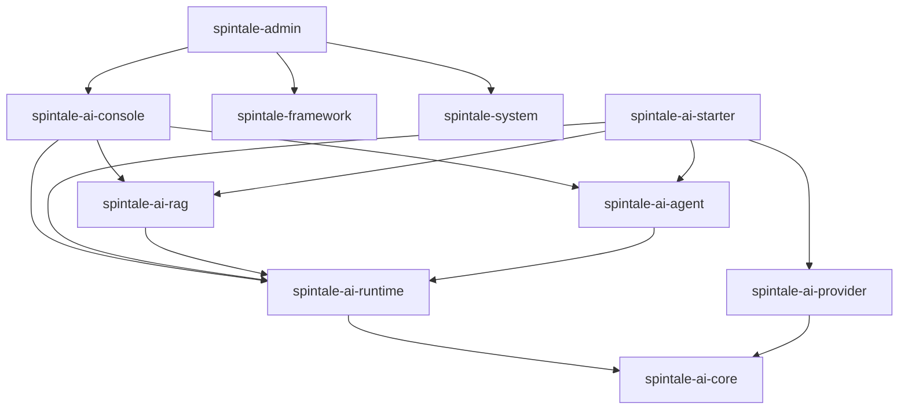

# SpinTale AI 模块重构与升级方案

## 1. 重新调整后的结论

上一版方案的问题是目标模块拆得过细，容易导致工程复杂度先上升，收益反而滞后。另外，`spintale-admin` 和 `spintale-ai-admin` 名称过于接近，不利于团队理解。

本版方案做两个重要调整：

1. **简化模块结构**：不再一次性拆出十几个 AI 子模块，而是先稳定在 7 个核心模块。
2. **调整管理模块命名**：不用 `spintale-ai-admin`，改为 `spintale-ai-console`。

最终推荐定位：

```text
spintale-admin        = Spring Boot / RuoYi 应用启动入口
spintale-ai-console   = AI 控制台能力模块
spintale-ai-starter   = AI 自动配置装配模块
spintale-ai-runtime   = AI 调用运行时
spintale-ai-core      = AI 核心抽象
spintale-ai-provider  = 模型供应商适配
spintale-ai-rag       = 知识库与 RAG
spintale-ai-agent     = Agent、Tool、Memory、Workflow
```

一句话目标：

```text
SpinTale AI = 面向 RuoYi 管理系统集成的 Java/Spring AI 应用运行平台。
```

---

## 2. 为什么不用 `spintale-ai-admin`

`spintale-ai-admin` 的问题：

1. 和现有 `spintale-admin` 过于相似，容易误解为另一个启动模块。
2. `admin` 在 RuoYi 项目中通常表示后台主应用，AI 模块再叫 admin 会混淆边界。
3. 后续如果 AI 管理端包含模型控制台、知识库调试台、RAG trace、Agent run history，`admin` 语义不够准确。

推荐命名：

```text
spintale-ai-console
```

理由：

1. `console` 更像控制台、运营台、调试台。
2. 与 `spintale-admin` 不冲突。
3. 能覆盖模型配置、知识库、Agent、Workflow、调用日志、成本统计、评估结果等管理能力。
4. 后续即使脱离 RuoYi，`console` 命名仍然成立。

|      |      |
| --- | --- |
|      |      |
|      |      |
|      |      |
|      |      |
|      |      |

---

## 3. 外部项目调研后的取舍

参考方向：

| 项目 | 借鉴点 | SpinTale 采用方式 |
| --- | --- | --- |
| Spring AI | ChatClient、Advisor、RAG、Vector Store、Observability | 借鉴 starter、advisor、runtime 装配思路 |
| LangChain4j | Java AI Service、Tool、Memory、RAG、Provider | 保留作为底层适配，不让业务层直接依赖 |
| Dify | Knowledge、Workflow、Provider、Run History | 借鉴 AI 控制台和运行记录 |
| RAGFlow | 文档解析、chunk、引用问答 | 强化 RAG 文档处理和 citation |
| Haystack | Pipeline、Component、Retriever、Generator | RAG 用 pipeline 思路组织 |
| LlamaIndex | Ingestion、Metadata、Rerank、Eval | RAG 入库、元数据、重排、评估分层 |
| OpenAI Agents SDK | Tool、Guardrail、Tracing、Handoff | Agent 加 trace、guardrail、工具权限 |
| LangGraph | Checkpoint、Human-in-the-loop、Durable Execution | 长任务后续引入 checkpoint，不在第一阶段过度设计 |

本项目不照搬这些框架的复杂结构。吸收原则是：

1. **Spring AI 的装配方式**，但不把整个项目改成 Spring AI clone。
2. **Dify 的控制台思路**，但不一开始做完整低代码平台。
3. **RAGFlow 的文档处理意识**，但先做可落地的 ingestion/retrieval/answer 三段。
4. **OpenAI Agents SDK 的可观测和安全思路**，但先从 Tool 权限、Run Trace、Guardrail 起步。

---

## 4. 推荐项目模块结构

### 4.1 最终推荐结构

```text
SpinTale
├── spintale-admin
├── spintale-common
├── spintale-framework
├── spintale-system
│
├── spintale-ai-core
├── spintale-ai-runtime
├── spintale-ai-provider
├── spintale-ai-rag
├── spintale-ai-agent
├── spintale-ai-starter
└── spintale-ai-console
```

### 4.2 为什么只保留这 7 个 AI 模块

| 模块 | 为什么保留 |
| --- | --- |
| `spintale-ai-core` | 必须有最底层抽象，保证其他模块不乱引用 |
| `spintale-ai-runtime` | 统一 AI 调用上下文、trace、成本、超时、重试 |
| `spintale-ai-provider` | 模型供应商适配经常变化，必须独立 |
| `spintale-ai-rag` | 知识库/RAG 是独立业务能力，不能塞进 agent 或 api |
| `spintale-ai-agent` | Agent、Tool、Memory、Workflow 先合并，避免过早拆细 |
| `spintale-ai-starter` | Spring Boot 自动配置必须独立 |
| `spintale-ai-console` | AI 管理控制台与 RuoYi 集成必须独立 |

### 4.3 暂不拆出的模块

以下模块暂时不独立，先作为 `spintale-ai-agent` 或 `spintale-ai-runtime` 内部包存在：

| 暂不独立模块 | 当前放置位置 | 后续独立条件 |
| --- | --- | --- |
| `spintale-ai-tool` | `spintale-ai-agent.tool` | Tool 类型很多、需要独立权限/审计/市场 |
| `spintale-ai-memory` | `spintale-ai-agent.memory` | Memory 同时被 Chat、Agent、Workflow 大量复用 |
| `spintale-ai-workflow` | `spintale-ai-agent.workflow` | 做可视化编排或复杂节点执行时再拆 |
| `spintale-ai-observability` | `spintale-ai-runtime.observability` | trace、metrics、cost 表达复杂后再拆 |
| `spintale-ai-evaluation` | `spintale-ai-runtime.evaluation` | 开始做正式评估平台后再拆 |

这样做的好处是：

1. 结构清晰，但不臃肿。
2. 不会一开始就制造过多 Maven 模块。
3. 后续仍然有自然拆分路径。

---

## 5. 模块职责和命名说明

### 5.1 `spintale-admin`

定位：应用启动入口。

职责：

1. Spring Boot 启动。
2. RuoYi 主后台入口。
3. 汇总依赖 `spintale-framework`、`spintale-system`、`spintale-ai-console`。
4. 不直接写 AI 核心逻辑。

禁止：

1. 不直接依赖具体模型 SDK。
2. 不直接写 RAG/Agent 实现。
3. 不把 AI provider 配置逻辑放进启动模块。

### 5.2 `spintale-ai-console`

定位：AI 控制台模块。

职责：

1. AI 管理接口。
2. RuoYi 权限适配。
3. RuoYi 操作日志适配。
4. `AjaxResult` 返回体适配。
5. 模型配置管理。
6. 知识库管理。
7. 文档索引任务查看。
8. Agent 配置管理。
9. Tool 权限配置。
10. Run History、Trace、Cost 查询。

包结构建议：

```text
com.spintale.ai.console
├── controller
├── application
├── dto
├── convert
├── permission
├── audit
├── menu
└── config
```

依赖方向：

```text
spintale-ai-console
    ↓
spintale-ai-runtime
    ↓
spintale-ai-core
```

也可以依赖：

```text
spintale-common
spintale-framework
spintale-system
```

因为它是明确的 RuoYi 集成层。

### 5.3 `spintale-ai-starter`

定位：Spring Boot 自动配置。

职责：

1. `@AutoConfiguration`。
2. `@ConfigurationProperties`。
3. 自动装配 runtime、provider、rag、agent。
4. 暴露默认 facade。
5. 提供默认 advisor chain。

禁止：

1. 不使用 `AjaxResult`。
2. 不使用 `SecurityUtils`。
3. 不使用 RuoYi `@Log`。
4. 不写管理端 Controller。
5. 不依赖 `spintale-system`。

### 5.4 `spintale-ai-core`

定位：最底层 AI 抽象。

职责：

1. Chat 请求/响应模型。
2. Message、TokenUsage、MediaContent。
3. AI 异常。
4. SPI 接口。
5. Provider 抽象。
6. 常量和基础工具。

禁止：

1. 不依赖 Spring Boot。
2. 不依赖 RuoYi。
3. 不依赖 LangChain4j 具体实现。
4. 不依赖数据库。

### 5.5 `spintale-ai-runtime`

定位：AI 调用运行时。

职责：

1. 统一 `traceId`、`runId`。
2. 统一调用上下文。
3. 统一 token、cost、latency 记录。
4. 统一 retry、timeout、fallback、budget。
5. 统一 streaming 生命周期。
6. 提供 run ledger。
7. 后续支持 checkpoint。

包结构建议：

```text
com.spintale.ai.runtime
├── context
├── execution
├── advisor
├── policy
├── observability
├── evaluation
└── checkpoint
```

### 5.6 `spintale-ai-provider`

定位：模型供应商适配。

职责：

1. OpenAI。
2. Ollama。
3. Azure OpenAI。
4. OpenAI-compatible。
5. Local Model。
6. Embedding Model。
7. Rerank Model。
8. Model Router。
9. Provider Capability。

包结构建议：

```text
com.spintale.ai.provider
├── registry
├── routing
├── capability
├── openai
├── ollama
├── azure
├── local
├── embedding
└── rerank
```

### 5.7 `spintale-ai-rag`

定位：知识库与 RAG。

职责：

1. 文档上传后的解析。
2. chunk。
3. metadata。
4. embedding。
5. vector store。
6. hybrid search。
7. rerank。
8. citation。
9. RAG trace。
10. RAG eval。

包结构建议：

```text
com.spintale.ai.rag
├── kb
├── document
├── ingestion
├── chunk
├── index
├── retrieval
├── rerank
├── answer
├── citation
└── eval
```

### 5.8 `spintale-ai-agent`

定位：Agent 及周边能力。

职责：

1. Agent 定义。
2. Agent Run。
3. Agent Step。
4. Tool Registry。
5. Tool Execution。
6. Tool Permission。
7. Memory。
8. Workflow。
9. Guardrail。
10. Human-in-the-loop。

包结构建议：

```text
com.spintale.ai.agent
├── definition
├── runtime
├── planner
├── executor
├── step
├── tool
├── memory
├── workflow
├── guardrail
└── store
```

---

## 6. 推荐依赖关系

### 6.1 总体依赖图



### 6.2 允许依赖

```text
spintale-admin -> spintale-ai-console
spintale-ai-console -> spintale-common / spintale-framework / spintale-system
spintale-ai-console -> spintale-ai-runtime / spintale-ai-rag / spintale-ai-agent
spintale-ai-starter -> spintale-ai-runtime / spintale-ai-provider / spintale-ai-rag / spintale-ai-agent
spintale-ai-rag -> spintale-ai-runtime
spintale-ai-agent -> spintale-ai-runtime
spintale-ai-provider -> spintale-ai-core
spintale-ai-runtime -> spintale-ai-core
```

### 6.3 禁止依赖

```text
spintale-ai-core -> Spring Boot starter
spintale-ai-core -> RuoYi
spintale-ai-runtime -> spintale-ai-console
spintale-ai-starter -> spintale-ai-console
spintale-ai-provider -> spintale-ai-console
spintale-ai-rag -> spintale-ai-console
spintale-ai-agent -> spintale-ai-console
```

---

## 7. 功能逻辑重构

## 7.1 Chat 调用链

目标调用链：

```text
Controller
 → Console Application Service
 → AiRuntime
 → Advisor Chain
 → Model Router
 → Provider Adapter
 → LLM
```

职责拆分：

| 层 | 职责 |
| --- | --- |
| Controller | 参数接收、权限注解、返回体适配 |
| Console Application Service | 管理端业务编排 |
| AiRuntime | trace、run context、策略、成本 |
| Advisor Chain | memory、rag、safety、cache、observability |
| Model Router | 模型选择和 fallback |
| Provider Adapter | 协议转换 |

## 7.2 RAG 调用链

```text
KnowledgeBaseController
 → RagApplicationService
 → Ingestion Pipeline / Retrieval Pipeline / Answer Pipeline
 → Runtime Trace
 → Provider
```

RAG 需要拆成三段：

```text
Ingestion Pipeline:
Source -> Parser -> Cleaner -> Chunker -> Metadata -> Embedding -> Index

Retrieval Pipeline:
Query -> Rewrite -> Filter -> Hybrid Search -> Rerank -> Context Build

Answer Pipeline:
Context -> Prompt -> Generate -> Citation -> Grounding Check
```

## 7.3 Agent 调用链

```text
AgentController
 → AgentApplicationService
 → AgentRuntime
 → Planner
 → Tool Executor
 → Observation
 → Final Answer
```

Agent 必须记录：

1. `AgentRun`。
2. `AgentStep`。
3. `ToolCall`。
4. `Observation`。
5. `TraceSpan`。
6. token/cost/latency。

---

## 8. 后续详细升级方案

## 8.1 阶段一：结构止血与命名统一

目标：先把工程结构讲清楚，避免后续继续耦合。

周期建议：1-2 周。

任务：

1. 确定最终 AI 模块命名：
   - `spintale-ai-console`
   - `spintale-ai-runtime`
   - `spintale-ai-provider`
   - `spintale-ai-rag`
   - `spintale-ai-agent`
   - `spintale-ai-starter`
   - `spintale-ai-core`
2. 将现有 `spintale-ai-retrieval` 规划为后续 `spintale-ai-rag`。
3. 将现有 `spintale-ai-providers` 规划为后续 `spintale-ai-provider`。
4. 明确 `spintale-admin` 只作为启动入口。
5. 明确 `spintale-ai-console` 作为 RuoYi 集成层。
6. starter 去除所有 RuoYi 依赖。
7. API 层移除 provider 具体实现。
8. 建立依赖方向检查规则。

交付物：

1. 模块命名规范。
2. Maven 模块结构。
3. 依赖方向图。
4. 编译通过。
5. 基础 smoke test。

验收标准：

1. `spintale-ai-core` 不依赖 Spring Boot 和 RuoYi。
2. `spintale-ai-starter` 不依赖 `spintale-common/framework/system`。
3. `spintale-admin` 不直接调用 provider SDK。
4. AI 子模块无循环依赖。

---

## 8.2 阶段二：AI Runtime 抽离

目标：所有 AI 调用都有统一运行上下文。

周期建议：2-3 周。

任务：

1. 新增 `AiRunContext`。
2. 新增 `AiRunResult`。
3. 新增 `AiExecutor`。
4. 新增 `StreamingExecutor`。
5. 新增 `AiExecutionPolicy`。
6. 统一 traceId/runId。
7. 统一 token usage。
8. 统一 cost 估算。
9. 统一 timeout/retry/fallback。
10. 将 Chat、RAG、Agent 调用逐步接入 runtime。

核心对象：

```text
AiRunContext
- traceId
- runId
- userId
- tenantId
- conversationId
- requestType
- model
- provider
- metadata

AiExecutionPolicy
- timeoutMs
- maxRetries
- fallbackModels
- maxCost
- streamEnabled
```

交付物：

1. `spintale-ai-runtime` 模块。
2. 统一执行入口。
3. Run event 事件。
4. runtime 单元测试。

验收标准：

1. Chat 调用能拿到 runId。
2. RAG 调用能记录 retrieval span。
3. Agent 调用能记录 step span。
4. 每次调用能记录 token/cost/latency。

---

## 8.3 阶段三：Provider 与模型路由升级

目标：从固定 provider 调用升级成模型能力目录和路由。

周期建议：2 周。

任务：

1. 设计 `ModelProvider`。
2. 设计 `ModelCapability`。
3. 设计 `ModelCatalog`。
4. 设计 `ModelRoutingPolicy`。
5. 支持 OpenAI-compatible provider。
6. 支持 Ollama/local provider。
7. 支持 embedding provider。
8. 支持 rerank provider。
9. 增加 fallback。
10. 增加 provider health check。

模型能力：

```text
ModelCapability
- chat
- streaming
- toolCalling
- structuredOutput
- vision
- embedding
- rerank
- maxContextTokens
- supportsJsonSchema
```

交付物：

1. provider registry。
2. model catalog。
3. routing policy。
4. provider health check。

验收标准：

1. 能按任务类型选择模型。
2. provider 不可用时能 fallback。
3. console 能查看 provider 状态。
4. 业务层不感知具体 SDK。

---

## 8.4 阶段四：RAG 重建

目标：从“向量检索”升级为完整知识库 RAG。

周期建议：3-5 周。

任务：

1. 将 `spintale-ai-retrieval` 改造为 `spintale-ai-rag`。
2. 建立知识库模型。
3. 建立文档状态机。
4. 建立 ingestion pipeline。
5. 建立 retrieval pipeline。
6. 建立 answer pipeline。
7. 支持 PDF/Word/Markdown/Text。
8. 支持 chunk metadata。
9. 支持 hybrid search。
10. 支持 rerank。
11. 支持 citation。
12. 支持 RAG trace。

文档状态：

```text
uploaded
parsing
chunking
embedding
indexed
failed
archived
```

核心表：

```text
ai_knowledge_base
ai_document
ai_document_chunk
ai_document_index_job
ai_retrieval_trace
```

交付物：

1. 知识库管理接口。
2. 文档上传接口。
3. 索引任务。
4. 检索调试接口。
5. citation answer。

验收标准：

1. 文档可上传、解析、索引。
2. chunk 可查询。
3. 回答能返回引用来源。
4. 检索过程有 trace。
5. 支持重新索引。

---

## 8.5 阶段五：Agent、Tool、Memory 升级

目标：Agent 可控，Tool 可审计，Memory 可治理。

周期建议：3-4 周。

任务：

1. 设计 AgentDefinition。
2. 设计 AgentRun。
3. 设计 AgentStep。
4. 设计 ToolDefinition。
5. Tool 增加 input/output schema。
6. Tool 增加权限码。
7. Tool 增加风险等级。
8. Tool 增加人工确认。
9. Memory 拆 short-term、summary、long-term。
10. Agent 调用接入 runtime trace。

Tool 风险等级：

| 等级 | 说明 | 策略 |
| --- | --- | --- |
| L0 | 只读工具 | 自动执行 |
| L1 | 低风险写入 | 自动执行并记录 |
| L2 | 业务写入 | 权限校验和审计 |
| L3 | 删除、发布、外部影响 | 人工确认 |

核心表：

```text
ai_agent
ai_agent_run
ai_agent_step
ai_tool
ai_tool_call
ai_memory_entry
```

交付物：

1. Agent 配置。
2. Tool 注册中心。
3. Tool 权限检查。
4. Agent run history。
5. Memory 管理。

验收标准：

1. Agent 每一步可追踪。
2. Tool 每次调用可审计。
3. 高风险 Tool 需要确认。
4. Memory 可查询、可删除、可过期。

---

## 8.6 阶段六：AI Console 完善

目标：从接口能力升级为可运营控制台。

周期建议：4-6 周。

功能菜单建议：

```text
AI 控制台
├── 模型管理
│   ├── Provider 配置
│   ├── Model Catalog
│   └── 路由策略
├── Prompt 管理
│   ├── Prompt 模板
│   └── Prompt 调试
├── 知识库
│   ├── 知识库列表
│   ├── 文档管理
│   ├── Chunk 查看
│   └── 检索调试
├── Agent
│   ├── Agent 配置
│   ├── Tool 管理
│   └── Run History
├── 运行观测
│   ├── 调用日志
│   ├── Trace 详情
│   ├── Token 成本
│   └── 异常统计
└── 评估
    ├── Eval Dataset
    ├── Eval Case
    └── Eval Report
```

任务：

1. 建立 console controller。
2. 建立 console application service。
3. 建立 DTO/VO。
4. 接入 RuoYi 权限。
5. 接入 RuoYi 菜单。
6. 接入操作日志。
7. 接入数据权限。

验收标准：

1. 管理端能配置 provider。
2. 管理端能管理知识库。
3. 管理端能查看 run history。
4. 管理端能查看 trace。
5. 管理端能查看成本统计。

---

## 8.7 阶段七：Evaluation 与持续优化

目标：模型、RAG、Prompt、Agent 迭代有质量依据。

周期建议：持续建设。

任务：

1. 建立 eval dataset。
2. 建立 eval case。
3. 建立 RAG recall@k。
4. 建立 citation accuracy。
5. 建立 answer groundedness。
6. 建立 Agent task success。
7. 建立 prompt regression。
8. 建立 provider A/B test。

核心表：

```text
ai_eval_dataset
ai_eval_case
ai_eval_result
ai_eval_metric
```

验收标准：

1. RAG 改 chunk 策略前后能对比。
2. Prompt 修改前后能回归。
3. Provider 切换前后能评估。
4. Agent 工具调用成功率可统计。

---

## 9. 数据库规划

## 9.1 第一阶段必需表

```text
ai_provider_config
ai_model_config
ai_run
ai_run_span
```

## 9.2 RAG 表

```text
ai_knowledge_base
ai_document
ai_document_chunk
ai_document_index_job
ai_retrieval_trace
```

## 9.3 Agent / Tool / Memory 表

```text
ai_agent
ai_agent_run
ai_agent_step
ai_tool
ai_tool_call
ai_memory_entry
```

## 9.4 后续评估表

```text
ai_eval_dataset
ai_eval_case
ai_eval_result
ai_eval_metric
```

---

## 10. 最终优先级

| 优先级 | 事项 | 说明 |
| --- | --- | --- |
| P0 | 模块命名统一 | 先解决 `spintale-admin` 与 AI 管理模块混淆问题 |
| P0 | 新增 `spintale-ai-console` | 作为 RuoYi AI 控制台集成层 |
| P0 | 新增 `spintale-ai-runtime` | 所有 AI 调用统一进入 runtime |
| P0 | starter 去 RuoYi | 保持 starter 可复用 |
| P1 | Provider capability | 支持模型路由和 fallback |
| P1 | RAG pipeline | 提升知识库质量 |
| P1 | Run ledger | 解决观测和成本问题 |
| P1 | Tool 权限审计 | 生产安全底线 |
| P2 | Agent run history | Agent 可调试、可追踪 |
| P2 | Console 菜单完善 | 产品化运营 |
| P3 | Workflow 可视化 | 后续增强，不作为早期重点 |
| P3 | 多 Agent | 有明确业务场景后再引入 |

---

## 11. 最终推荐路线

最务实的路线是：

```text
第一步：确定命名和模块边界
第二步：做 runtime
第三步：做 provider routing
第四步：重建 RAG
第五步：治理 Agent / Tool / Memory
第六步：完善 console
第七步：增加 evaluation
```

不要一开始就拆出过多模块，也不要一开始就做低代码 Workflow 或多 Agent。当前项目最需要先解决的是：

1. 命名清楚。
2. 边界清楚。
3. 调用链清楚。
4. 运行记录清楚。
5. RAG 和 Agent 后续能自然扩展。

推荐最终结构再次确认：

```text
SpinTale
├── spintale-admin
├── spintale-common
├── spintale-framework
├── spintale-system
├── spintale-ai-core
├── spintale-ai-runtime
├── spintale-ai-provider
├── spintale-ai-rag
├── spintale-ai-agent
├── spintale-ai-starter
└── spintale-ai-console
```
