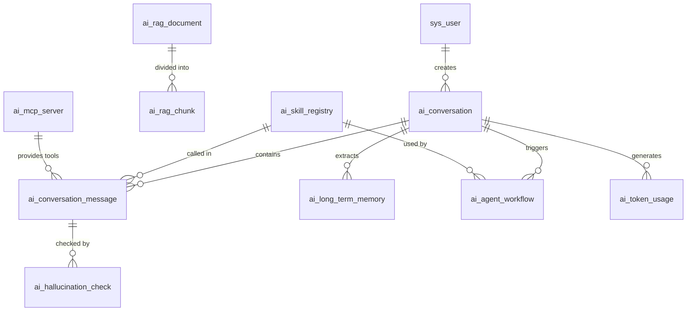

# SpinTale AI 模块数据库设计文档

## 概述

本文档详细说明 SpinTale AI 模块的数据库设计，包括现有系统表结构和新增的 AI 专用表结构。

## 数据库架构

### 技术栈
- **关系型数据库**: MySQL 8.0+ (主数据存储)
- **向量数据库**: Milvus 2.x (向量嵌入存储)
- **缓存数据库**: Redis 7.x (会话和记忆缓存)
- **工作流引擎**: Temporal (工作流状态管理)

### 数据流向
```
用户请求 → Controller → Service → 
  ├─ MySQL (持久化存储)
  ├─ Redis (缓存层)
  ├─ Milvus (向量检索)
  └─ Temporal (异步工作流)
```

## 现有系统表 (spintale_20260417.sql)

### 基础系统表 (1-20)
1. `sys_dept` - 部门表
2. `sys_user` - 用户信息表
3. `sys_post` - 岗位信息表
4. `sys_role` - 角色信息表
5. `sys_menu` - 菜单权限表
6. `sys_user_role` - 用户和角色关联表
7. `sys_role_menu` - 角色和菜单关联表
8. `sys_user_post` - 用户与岗位关联表
9. `sys_dict_type` - 字典类型表
10. `sys_dict_data` - 字典数据表
11. `sys_config` - 参数配置表
12. `sys_logininfor` - 登录日志表
13. `sys_operlog` - 操作日志表
14. `sys_job` - 定时任务调度表
15. `sys_login_token` - 登录令牌表
16. `sys_cache` - 缓存列表
17. `sys_notice` - 通知公告表
18. `sys_notice_read` - 公告已读记录表
19. `gen_table` - 代码生成业务表
20. `gen_table_column` - 代码生成业务表字段

## 新增 AI 模块表 (spintale_ai_extension.sql)

### 21. ai_conversation - AI 对话会话表

**用途**: 存储 AI 对话会话的元数据，支持多轮对话管理

**关键字段**:
- `session_id`: 会话唯一标识 (UUID)
- `user_id`: 用户 ID
- `model_name`: 使用的 AI 模型
- `temperature`: 温度参数
- `total_messages`: 消息总数
- `total_tokens`: 消耗 token 总数
- `status`: 状态 (0 进行中/1 已结束/2 已归档)

**索引设计**:
- 主键：conversation_id
- 唯一索引：session_id
- 普通索引：user_id, status, create_time

**使用场景**:
- 会话列表查询
- 会话历史追溯
- Token 使用统计

---

### 22. ai_conversation_message - AI 对话消息表

**用途**: 存储对话中的每条消息，支持分支对话和工具调用

**关键字段**:
- `conversation_id`: 关联会话 ID
- `parent_id`: 父消息 ID (支持分支对话)
- `role`: 角色 (system/user/assistant/tool)
- `content`: 消息内容 (支持长文本)
- `content_type`: 内容类型 (text/markdown/json/image)
- `tool_calls`: 工具调用信息 (JSON)
- `tokens_used`: 消耗 token 数
- `latency_ms`: 响应延迟

**索引设计**:
- 主键：message_id
- 普通索引：conversation_id, parent_id, role, create_time

**使用场景**:
- 对话历史加载
- 消息溯源
- 性能分析

---

### 23. ai_long_term_memory - AI 长期记忆表

**用途**: 实现跨会话的长期记忆，支持记忆的重要性评分和过期机制

**关键字段**:
- `user_id`: 用户 ID
- `memory_type`: 记忆类型 (fact/preference/context/skill)
- `category`: 记忆分类
- `content`: 记忆内容
- `importance`: 重要性评分 (1-10)
- `confidence`: 置信度 (0-1)
- `access_count`: 访问次数
- `expiration_time`: 过期时间

**索引设计**:
- 主键：memory_id
- 普通索引：user_id, memory_type, category, is_active, importance

**使用场景**:
- 用户偏好记忆
- 事实知识存储
- 上下文记忆提取

**与 Redis 配合**:
- Redis 存储热点记忆 (最近访问)
- MySQL 存储全量记忆 (持久化)

---

### 24. ai_rag_document - RAG 文档索引表

**用途**: RAG 系统的文档元数据管理，与 Milvus 向量数据库配合使用

**关键字段**:
- `doc_uuid`: 文档唯一标识 (UUID)
- `filename`: 文件名
- `file_type`: 文件类型 (pdf/md/docx/txt)
- `chunk_count`: 分块数量
- `embedding_model`: 嵌入模型
- `vector_collection`: 向量集合名称
- `status`: 处理状态 (0 待处理/1 处理中/2 已完成/3 失败)

**索引设计**:
- 主键：document_id
- 唯一索引：doc_uuid
- 普通索引：file_type, status, create_time

**使用场景**:
- 文档上传管理
- 索引状态跟踪
- 文档删除清理

---

### 25. ai_rag_chunk - RAG 文档分块表

**用途**: 存储文档分块内容和向量引用

**关键字段**:
- `document_id`: 关联文档 ID
- `chunk_index`: 分块索引
- `content`: 分块内容
- `token_count`: token 数量
- `embedding_vector`: 嵌入向量 (二进制备份)
- `vector_id`: Milvus 中的向量 ID

**索引设计**:
- 主键：chunk_id
- 普通索引：document_id, chunk_index, vector_id

**使用场景**:
- 分块内容检索
- 向量 ID 映射
- 增量更新

**与 Milvus 配合**:
- Milvus: 存储向量数据和相似度搜索
- MySQL: 存储原文内容和元数据

---

### 26. ai_agent_workflow - AI Agent 工作流实例表

**用途**: Temporal 工作流引擎的状态持久化和审计

**关键字段**:
- `workflow_uuid`: 工作流唯一标识 (UUID)
- `workflow_type`: 工作流类型 (research/coding/analysis/custom)
- `agent_type`: Agent 类型 (react/planning/collaborative)
- `status`: 状态 (RUNNING/COMPLETED/FAILED/CANCELLED)
- `input_data`: 输入数据 (JSON)
- `output_data`: 输出数据 (JSON)
- `execution_log`: 执行日志 (JSON)
- `duration_ms`: 执行时长

**索引设计**:
- 主键：workflow_id
- 唯一索引：workflow_uuid
- 普通索引：user_id, workflow_type, status

**使用场景**:
- 工作流状态查询
- 执行历史审计
- 性能分析优化

**与 Temporal 配合**:
- Temporal: 管理工作流执行和状态
- MySQL: 持久化历史记录和业务查询

---

### 27. ai_skill_registry - AI 技能注册表

**用途**: 技能系统的注册中心，支持动态加载和管理技能

**关键字段**:
- `skill_key`: 技能标识 (唯一)
- `skill_name`: 技能名称
- `skill_type`: 技能类型 (builtin/custom/plugin)
- `class_name`: 实现类名
- `input_schema`: 输入 Schema (JSON Schema)
- `output_schema`: 输出 Schema (JSON Schema)
- `enabled`: 是否启用
- `usage_count`: 使用次数
- `success_rate`: 成功率

**索引设计**:
- 主键：skill_id
- 唯一索引：skill_key
- 普通索引：skill_type, enabled

**使用场景**:
- 技能发现
- 动态加载
- 使用统计

---

### 28. ai_hallucination_check - AI 幻觉检测记录表

**用途**: 幻觉检测的记录和审核流程

**关键字段**:
- `message_id`: 关联消息 ID
- `check_strategy`: 检测策略
- `confidence_score`: 置信度评分 (0-1)
- `risk_level`: 风险等级 (low/medium/high/critical)
- `detected_issues`: 检测到的问题 (JSON)
- `evidence_sources`: 证据来源 (JSON)
- `suggested_action`: 建议操作
- `review_status`: 审核状态

**索引设计**:
- 主键：check_id
- 普通索引：message_id, conversation_id, user_id, risk_level, review_status

**使用场景**:
- 幻觉检测记录
- 人工审核流程
- 质量分析报告

---

### 29. ai_token_usage - AI Token 使用统计表

**用途**: Token 使用统计和成本核算

**关键字段**:
- `user_id`: 用户 ID
- `model_name`: 模型名称
- `date`: 日期
- `prompt_tokens`: 提示 token 数
- `completion_tokens`: 完成 token 数
- `total_tokens`: 总 token 数
- `cost_usd`: 成本 (美元)
- `request_count`: 请求次数

**索引设计**:
- 主键：usage_id
- 唯一索引：uk_user_model_date (user_id, model_name, date)
- 普通索引：user_id, model_name, date

**使用场景**:
- 成本核算
- 使用趋势分析
- 配额管理

---

### 30. ai_mcp_server - AI MCP 服务器配置表

**用途**: MCP (Model Context Protocol) 协议的服务器配置管理

**关键字段**:
- `server_name`: 服务器名称
- `server_url`: 服务器 URL
- `server_type`: 服务器类型 (sse/stdio)
- `capabilities`: 能力列表 (JSON)
- `auth_type`: 认证类型 (none/api_key/oauth2)
- `health_status`: 健康状态
- `connection_count`: 连接次数

**索引设计**:
- 主键：server_id
- 唯一索引：server_name
- 普通索引：server_type, enabled, health_status

**使用场景**:
- MCP 服务器管理
- 健康检查
- 连接统计

---

## 数据库关系图



---

## 数据一致性保障

### 事务边界
1. **对话创建**: 同时创建 ai_conversation 和第一条 ai_conversation_message
2. **记忆提取**: 读取 ai_long_term_memory 并更新 access_count
3. **RAG 索引**: 先插入 ai_rag_document，再批量插入 ai_rag_chunk，最后更新状态

### 异步处理
1. **向量嵌入**: 文档上传后异步生成向量并写入 Milvus
2. **Token 统计**: 对话结束后异步聚合到 ai_token_usage
3. **幻觉检测**: 消息生成后异步触发检测流程

### 数据归档
1. **对话消息**: 超过 6 个月的消息可归档到历史表
2. **工作流记录**: 已完成的工作流可定期清理
3. **检测记录**: 已审核的检测记录可压缩存储

---

## 性能优化建议

### 分区策略
1. **ai_conversation_message**: 按 create_time 月度分区
2. **ai_long_term_memory**: 按 user_id 范围分区
3. **ai_token_usage**: 按 date 月度分区

### 缓存策略
1. **Redis 缓存**: 
   - 会话信息 (30 分钟 TTL)
   - 热点记忆 (1 小时 TTL)
   - 技能注册表 (5 分钟 TTL)

2. **Milvus 向量**:
   - IVF_FLAT 索引 (nlist=1024)
   - 定期 compaction

### 查询优化
1. 避免 SELECT *，只查询必要字段
2. 对大文本字段使用延迟加载
3. 分页查询使用游标而非 OFFSET

---

## 安全考虑

### 数据加密
1. **敏感字段加密**: content 字段可选 AES-256 加密
2. **传输加密**: 所有数据库连接使用 TLS
3. **密钥管理**: 使用 KMS 管理加密密钥

### 访问控制
1. **行级权限**: 用户只能访问自己的对话和记忆
2. **审计日志**: 所有写操作记录到 sys_operlog
3. **数据脱敏**: 日志中的敏感信息自动脱敏

---

## 备份恢复

### 备份策略
1. **全量备份**: 每日凌晨 2 点
2. **增量备份**: 每小时一次
3. **Binlog**: 实时同步

### 恢复流程
1. 从最近的 full backup 恢复
2. 应用 incremental backup
3. 重放 binlog 到指定时间点

---

## 迁移指南

### 从旧版本升级
```sql
-- 1. 备份现有数据库
mysqldump -u root -p spintale > backup_$(date +%Y%m%d).sql

-- 2. 执行扩展脚本
mysql -u root -p spintale < spintale_ai_extension.sql

-- 3. 验证表结构
SHOW TABLES LIKE 'ai_%';

-- 4. 检查数据完整性
SELECT COUNT(*) FROM ai_skill_registry;
```

### 数据迁移脚本
提供 Python/Java 工具用于从旧系统迁移对话历史到新的表结构。

---

## 监控指标

### 数据库层面
- QPS/TPS
- 慢查询数量
- 连接池使用率
- 磁盘空间使用

### 业务层面
- 每日活跃会话数
- 平均对话长度
- 记忆提取命中率
- RAG 检索延迟
- 工作流成功率
- Token 消耗趋势

---

## 附录

### A. 字段命名规范
- 主键：`{table_name}_id`
- 外键：`{referenced_table}_id`
- 布尔值：`is_{adjective}` 或 `has_{noun}`
- 时间戳：`{event}_time`
- JSON 字段：`{domain}_data` 或 `metadata`

### B. 枚举值规范
- 状态：0=初始/进行中，1=成功/完成，2=失败/异常
- 布尔：0=否，1=是
- 风险等级：low/medium/high/critical

### C. 版本历史
- v1.0 (2026-04-17): 初始版本，包含 10 个 AI 专用表
- v1.1 (计划): 增加数据分区和归档策略
