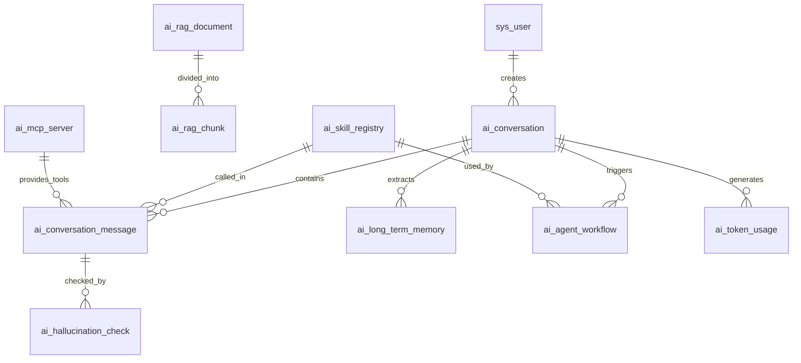

# SpinTale AI 模块数据库升级总结

## 概述

本次数据库升级旨在支持 SpinTale AI 模块的核心功能，包括长期记忆、RAG 检索增强生成、Agent 工作流、技能系统和幻觉检测。

## 升级内容

### 新增数据表 (10 张)

| 序号 | 表名 | 用途 | 关联组件 |
|------|------|------|----------|
| 21 | `ai_conversation` | AI 对话会话管理 | 对话系统 |
| 22 | `ai_conversation_message` | 对话消息存储 (支持分支对话) | 对话系统 |
| 23 | `ai_long_term_memory` | 长期记忆存储 | 记忆系统 |
| 24 | `ai_rag_document` | RAG 文档元数据 | RAG 检索 |
| 25 | `ai_rag_chunk` | RAG 文档分块 | RAG 检索 |
| 26 | `ai_agent_workflow` | Agent 工作流实例 | Temporal 工作流 |
| 27 | `ai_skill_registry` | 技能注册中心 | 技能系统 |
| 28 | `ai_hallucination_check` | 幻觉检测记录 | 幻觉检测 |
| 29 | `ai_token_usage` | Token 使用统计 | 成本核算 |
| 30 | `ai_mcp_server` | MCP 服务器配置 | MCP 协议 |

### 依赖的外部存储

| 存储类型 | 产品 | 用途 | 配置位置 |
|----------|------|------|----------|
| 关系型数据库 | MySQL 8.0+ | 主数据存储 | `application.yml` |
| 向量数据库 | Milvus 2.x | 向量嵌入存储 | `docker-compose.yml` |
| 缓存数据库 | Redis 7.x | 会话和记忆缓存 | `application.yml` |
| 工作流引擎 | Temporal | 工作流状态管理 | `docker-compose.yml` |

## 文件清单

```
sql/
├── spintale_20260417.sql        # 基础系统表 (20 张表)
├── spintale_ai_extension.sql    # AI 模块扩展表 (10 张新表) ⭐ NEW
└── quartz.sql                   # 定时任务调度表

docs/guides/
├── DATABASE_DESIGN.md           # 完整数据库设计文档 ⭐ NEW
└── DEPLOYMENT_GUIDE.md          # 部署指南 (含 Docker 配置)
```

## 升级步骤

### 1. 备份现有数据库

```bash
mysqldump -u root -p spintale > backup_$(date +%Y%m%d_%H%M%S).sql
```

### 2. 执行扩展脚本

```bash
mysql -u root -p spintale < sql/spintale_ai_extension.sql
```

### 3. 验证表结构

```sql
-- 检查新表是否创建成功
SHOW TABLES LIKE 'ai_%';

-- 检查表数量 (应该是 10 张)
SELECT COUNT(*) 
FROM information_schema.tables 
WHERE table_schema = 'spintale' 
AND table_name LIKE 'ai_%';

-- 检查初始化数据
SELECT skill_key, skill_name FROM ai_skill_registry;
SELECT server_name FROM ai_mcp_server;
```

### 4. 启动外部依赖

```bash
# 启动 Milvus 和 Temporal
cd /workspace
docker compose up -d

# 验证服务健康状态
curl http://localhost:9091/healthz              # Milvus
curl http://localhost:8233/api/v1/namespaces    # Temporal
```

### 5. 配置应用

编辑 `application-local.yml`:

```yaml
spring:
  datasource:
    url: jdbc:mysql://localhost:3306/spintale?useUnicode=true&characterEncoding=utf8&serverTimezone=Asia/Shanghai
    username: root
    password: your_password

  redis:
    host: localhost
    port: 6379

# Milvus 配置
milvus:
  host: localhost
  port: 19530
  collection: spintale_rag

# Temporal 配置
temporal:
  target: localhost:7233
  namespace: spintale
```

### 6. 运行应用并测试

```bash
# 构建项目
mvn clean package -DskipTests

# 启动应用
java -jar spintale-admin/target/spintale-admin.jar --spring.profiles.active=local

# 测试 API
curl -X GET http://localhost:8080/ai/rag/documents
```

## 关键设计特性

### 1. 混合存储架构

```
用户请求 → Service 层 → 
  ├─ MySQL (结构化数据、元数据)
  ├─ Redis (热点数据缓存)
  ├─ Milvus (向量相似度搜索)
  └─ Temporal (异步工作流)
```

### 2. 数据一致性保障

- **事务边界**: 对话创建同时写入 `ai_conversation` 和 `ai_conversation_message`
- **异步处理**: 向量嵌入、Token 统计、幻觉检测采用异步流程
- **补偿机制**: 失败的工作流自动重试或回滚

### 3. 性能优化

- **索引设计**: 所有查询字段均建立索引
- **分区策略**: 大表支持按时间/用户分区
- **缓存策略**: Redis 缓存热点数据 (TTL 可配置)

### 4. 扩展性设计

- **JSON 字段**: 灵活存储动态 Schema 数据
- **技能注册**: 支持动态加载自定义技能
- **MCP 协议**: 支持扩展外部工具和服务

## 数据关系图



## 监控指标

### 数据库层面
- QPS/TPS
- 慢查询数量 (< 100ms)
- 连接池使用率 (< 80%)
- 磁盘空间使用 (< 70%)

### 业务层面
- 每日活跃会话数
- 平均对话长度
- 记忆提取命中率 (> 80%)
- RAG 检索延迟 (< 200ms)
- 工作流成功率 (> 95%)
- Token 消耗趋势

## 常见问题

### Q1: 向量数据存储在哪个数据库？

**A**: 向量数据存储在 Milvus 中，MySQL 的 `ai_rag_chunk.embedding_vector` 字段仅作为二进制备份。

### Q2: Temporal 工作流状态如何持久化？

**A**: Temporal 使用自己的 PostgreSQL 数据库存储工作流状态，MySQL 的 `ai_agent_workflow` 表用于业务查询和审计。

### Q3: 长期记忆如何与 Redis 配合？

**A**: 
- Redis 存储热点记忆 (最近访问的记忆，TTL=1 小时)
- MySQL 存储全量记忆 (持久化)
- 读取时先查 Redis，未命中再查 MySQL 并回填 Redis

### Q4: 如何清理过期数据？

**A**: 
- 对话消息：超过 6 个月的数据可归档到历史表
- 工作流记录：已完成的工作流定期清理 (保留 30 天)
- 检测记录：已审核的记录压缩存储

### Q5: 数据库升级后需要重启应用吗？

**A**: 是的，需要重启应用以加载新的表结构和配置。

## 回滚方案

如果升级失败，执行以下回滚步骤：

```bash
# 1. 停止应用
kill -9 $(ps aux | grep spintale | grep -v grep | awk '{print $2}')

# 2. 恢复备份
mysql -u root -p spintale < backup_YYYYMMDD_HHMMSS.sql

# 3. 删除新表 (可选，如果备份不包含 DROP 语句)
mysql -u root -p spintale -e "DROP TABLE IF EXISTS ai_conversation, ai_conversation_message, ..."

# 4. 重启应用
java -jar spintale-admin.jar
```

## 后续优化计划

### v1.1 (计划)
- [ ] 实现表分区 (按月/用户)
- [ ] 增加数据归档任务
- [ ] 优化 JSON 字段索引
- [ ] 增加读写分离配置

### v1.2 (计划)
- [ ] 支持多租户隔离
- [ ] 增加全文检索 (Elasticsearch)
- [ ] 实现数据同步 CDC
- [ ] 增加监控告警

## 参考文档

- [完整数据库设计](./docs/guides/DATABASE_DESIGN.md)
- [部署指南](./docs/guides/DEPLOYMENT_GUIDE.md)
- [解决方案](./docs/guides/SOLUTIONS.md)
- [技术选型报告](./docs/guides/TECH_SELECTION_REPORT.md)

---

**更新日期**: 2026-04-17  
**版本**: v1.0  
**维护者**: SpinTale 团队
